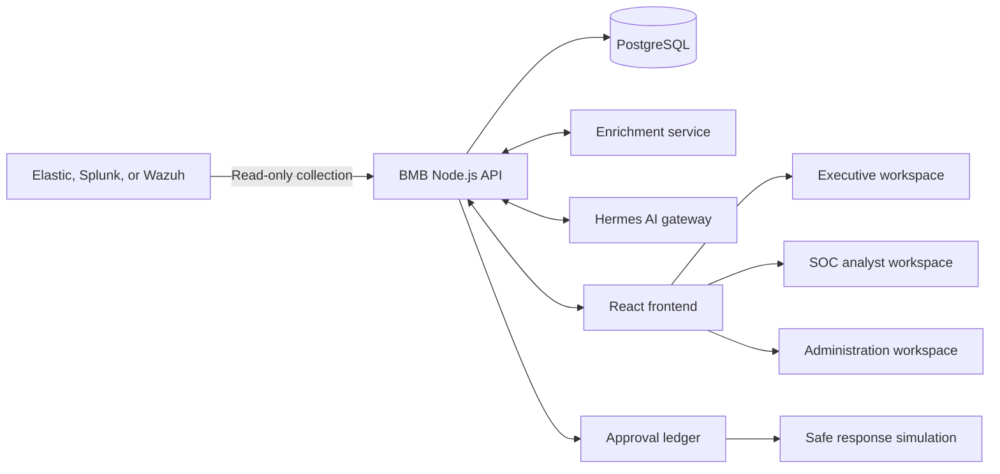
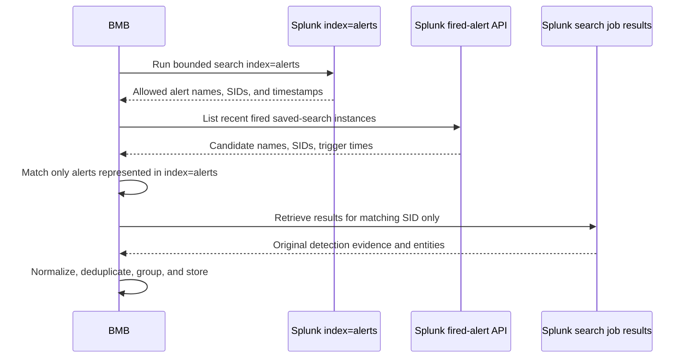

# BMB Security Operations: Current Project and Technical Summary

**Current as of:** August 16, 2026  
**Purpose:** Explain what BMB is, how its major components work together, and what was added or corrected most recently.

## 1. Project overview

BMB is a security-operations platform that sits between enterprise security data, SOC analysts, executives, administrators, and an AI analysis service.

It currently provides three role-specific experiences from one application:

- **Executive:** risk posture, critical incidents, exposed services, response performance, decision queues, and evidence-backed reports.
- **SOC Analyst:** live monitoring, analytics, triage, investigations, incidents, cases, approvals, response simulations, assets, entity intelligence, and vulnerabilities.
- **Security Administrator:** integrations, collector health, AI configuration, users and access, audit governance, retention, reports, and settings.

The platform does not replace Elastic or Splunk. Those systems remain the external security data sources. BMB creates a normalized operational layer where alerts can be reviewed, enriched, triaged, correlated, investigated, and audited consistently.

## 2. Architecture



### Component responsibilities

| Component | Responsibility |
|---|---|
| **React/Vite frontend** | Role-aware workspaces, monitoring, triage, investigations, incidents, administration, and AI-assisted interaction. |
| **Node.js API** | Authentication, RBAC, connector management, collection, normalization, enrichment orchestration, AI policy, workflows, validation, and audit. |
| **PostgreSQL** | Durable alerts, triage results, incidents, investigations, cases, users, settings, connectors, AI runs, approvals, and audit events. |
| **Elastic / Splunk / Wazuh** | External security telemetry and detection sources. BMB accesses them through read-only connectors. |
| **Enrichment service** | Identity, CMDB, endpoint, threat-intelligence, and vulnerability context. |
| **Hermes** | A controlled gateway for AI triage, correlation, and analyst chat. |
| **nginx** | Serves the frontend and forwards `/api` requests to the API container. |

The most important trust rule is:

> Hermes analyzes evidence, but the BMB API controls access, validation, persistence, permissions, and actions.

## 3. Authentication and role separation

BMB uses one login page. Users do not select a role during login.

1. The user submits a username and password.
2. The API verifies the account stored in PostgreSQL.
3. The server returns a signed, HTTP-only session containing the server-assigned role.
4. The frontend redirects the user to the correct landing page.
5. Both frontend route guards and backend permission checks enforce access.

Default landing pages are:

- Executive: `/dashboard`
- SOC Analyst: `/live-monitoring`
- Security Administrator: `/integrations`

Administrators can create and remove users and assign one of the supported roles. A user cannot change roles from the browser or gain access by manually entering another route.

## 4. Alert lifecycle

```text
External security source
        |
        v
Read-only collection
        |
        v
Normalize and deduplicate
        |
        v
Store in PostgreSQL and show in Live Monitoring
        |
        v
Enrich with identity, asset, endpoint, threat, and vulnerability context
        |
        v
AI triage, when enabled
        |
        v
Deterministic candidate selection and AI-assisted correlation
        |
        v
Validated incident, investigation, and case workflows
```

### Collection is independent from AI

Live collection does not require an AI cycle. New alerts can be collected and displayed while triage, correlation, and autonomous workflow processing are disabled.

This separation prevents an unavailable or expensive AI model from blocking the monitoring feed.

### Normalization

Elastic, Splunk, and Wazuh use different field names. The API converts source events into a common BMB alert structure containing fields such as:

- stable alert ID;
- timestamp;
- detection name;
- severity and rule level;
- username and hostname;
- source and destination IP;
- process and executable details;
- dataset and event action;
- original technical evidence.

Normalization lets the same monitoring, grouping, triage, analytics, and investigation pages work across multiple security platforms.

### Deduplication and grouping

- **Deduplication** prevents the same source event from being inserted repeatedly.
- **Grouping** combines repeated alerts that represent the same activity while preserving the individual records and occurrence count.

Repeated Splunk alerts now use stable grouping evidence such as the normalized alert name and affected entities rather than the firing timestamp. For example, many occurrences of `BMB - Port flapping` can appear as one grouped activity while analysts can still drill into the individual firings.

## 5. AI triage, correlation, and investigation

### AI triage

Triage starts only for stored alerts that are successfully enriched, remain pending, and fall within the configured item and token budgets.

Hermes receives a bounded evidence package. It must return a validated structured result containing:

- verdict;
- assessed severity;
- confidence;
- findings and attack stage;
- recommended next steps;
- evidence citations;
- limitations.

Supported verdicts include `true_positive`, `false_positive`, `needs_investigation`, and `benign_anomaly`.

The API rejects malformed answers and citations that do not refer to supplied evidence. Failures remain visible instead of being silently treated as successful triage.

### Correlation

Correlation does not send the entire alert database to AI.

1. The API selects newly triaged alerts and a bounded recent context set.
2. Deterministic checks identify plausible relationships through exact entities such as user, host, IP, process, or target database within a time window.
3. Hermes proposes possible multi-alert incident groups.
4. The API verifies alert IDs, connectivity, time windows, duplicate membership, and overlap with existing incidents.
5. Only validated groups create or update incidents.

An incident therefore represents a validated relationship between multiple alerts, not merely a severe alert or an AI-written story.

### Investigations and cases

- **Investigation:** evidence workspace used to document findings and follow-up.
- **Incident:** validated correlated security event.
- **Case:** durable ownership, status, notes, SLA, and reporting workflow.

These records remain separate so an alert, AI verdict, or recommendation is never mistaken for a confirmed incident or executed response.

### AI model routing

Administrators can select an allowlisted AI profile from the AI Configuration page:

- GPT-5.6 Sol through the configured Hermes route.
- Meta Llama 3.3 70B through OpenRouter and Hermes.

The selected provider and model are sent explicitly for new runs. BMB validates the runtime model identity and fails visibly rather than silently falling back to a different model.

## 6. Human approval and response safety

BMB does not claim to perform real endpoint isolation, account suspension, firewall blocking, or Elastic modification.

Sensitive proposed actions enter the Approval Queue. Safe Response Simulation records the proposed action, evidence, expected result, verification, rollback simulation, and audit history without changing an external system.

This provides a realistic human-control workflow while keeping the lab safe and honest.

## 7. Dashboard-managed security connectors

Security Administrators can create connectors from the dashboard instead of hardcoding client infrastructure into `.env` files.

The connector workflow is:

1. **Save:** validate configuration and encrypt the credential.
2. **Test:** perform a bounded read-only authentication and sample search.
3. **Activate:** make the successfully tested connector the active collection source.
4. **Disable or replace:** stop using it without deleting stored BMB workflow data.

Connector credentials and CA certificates are encrypted with AES-256-GCM before PostgreSQL storage. The browser receives only safe status and endpoint metadata.

The current connector types are:

- Elastic;
- Splunk;
- Wazuh.

Environment configuration remains a bootstrap fallback when no dashboard-managed connector is active.

## 8. Latest Splunk implementation

The most recent work corrected how BMB collects and understands Splunk alerts.

### Connection model

- BMB connects to Splunk Enterprise through the management REST API on port `8089`.
- Authentication uses a read-only bearer token or supported Splunk session token.
- Port `8000` is the Splunk web interface and is not scraped.
- Port `8088` is HEC ingestion and is not required for this read-only collector.

### Two supported collection modes

1. **Index search:** runs a bounded SPL search through `search/jobs/export`.
2. **Triggered alerts with result context:** uses the configured alert index as the strict collection scope, then retrieves the matching saved-search result rows.

### Why the previous Splunk records were unclear

The first Splunk integration collected thin alert notifications. A notification could contain only fields such as:

- `source=alert:Automation - Network - Potential C2 Beaconing Detected`;
- `sourcetype=generic_single_line`;
- a timestamp;
- a message similar to `Alert triggered! Raw log:`.

That was enough to know an alert fired, but not enough to understand the affected IP, host, user, process, or original result evidence. The UI therefore displayed generic names and incomplete triage context.

### Current `index=alerts` collection flow



The authoritative collection scope is now **only `index=alerts`**.

Technically, BMB:

1. Runs the configured bounded `search index=alerts` query.
2. Extracts the alert name, SID when available, and observation timestamp.
3. Lists recent fired-alert metadata only as a context lookup.
4. Matches each indexed notification one-to-one:
   - exact SID when available; or
   - normalized alert name plus a close trigger timestamp.
5. Retrieves `/search/jobs/{sid}/results` only for the matched alert.
6. Ignores every fired alert that is not represented in `index=alerts`.

This prevents BMB from importing every alert visible in Splunk's Triggered Alerts page while still obtaining the detailed evidence needed for triage.

### Context normalization improvements

For matched Splunk results, BMB now derives useful fields from both the alert metadata and the result row:

- saved-search name becomes the detection title;
- Splunk severity becomes the normalized source severity and rule level;
- host, source IP, destination IP, process, user, dataset, and event action are preserved when available;
- the retrieved result becomes the evidence used by triage;
- repeated named alerts share a stable grouping key across different firing times.

If Splunk reports fired alerts but the matching job results cannot be read, testing fails visibly instead of importing context-free placeholders.

### Required Splunk permissions

The connector role must be able to:

- search `index=alerts`;
- use the search export endpoint;
- list fired alerts in the configured owner/app namespace;
- read the matching search job results;
- read its authentication context.

TLS verification should remain enabled in production. A private Splunk CA can be stored through the connector configuration.

## 9. Latest frontend and product work

The frontend was rebuilt around a shared enterprise design system rather than page-specific styling.

Recent changes include:

- unified dark security theme, typography, spacing, cards, buttons, badges, tables, empty states, and motion;
- redesigned Technical Triage split workspace with visible AI status in the queue;
- redesigned Live Monitoring feed with grouped and individual views;
- redesigned SOC Analytics, Cases, Incidents, and Investigations;
- redesigned Assets and Entity Intelligence workspaces;
- corrected Assets hard-refresh routing so nginx returns the React application instead of redirecting to Elastic;
- role-specific navigation and landing pages;
- consolidated context-aware AI assistant;
- clearer source health, connector status, and data-trust states.

The frontend displays observed evidence and recorded workflow state. It does not invent missing source data or use browser-local changes as durable analyst actions.

## 10. Retention and operational controls

BMB supports severity-aware PostgreSQL alert retention:

- critical alerts: 14 days;
- high alerts: 10 days;
- other alerts: 7 days by default.

Evidence already linked to incidents, investigations, or response simulations is protected from ordinary retention deletion. Retention affects BMB's stored operational copy, not the external Elastic or Splunk source.

Collection, enrichment, triage, correlation, and autonomous workflow processing have separate controls. This allows administrators to keep live monitoring active while pausing expensive or unavailable AI processing.

## 11. What is real and what remains limited

### Implemented and durable

- Server-enforced authentication and RBAC
- Administrator-managed users
- Read-only Elastic, Splunk, and Wazuh connector framework
- Encrypted dashboard-managed connector credentials
- AI-independent live collection
- Alert normalization, deduplication, and grouping
- Enrichment, AI triage, correlation, incidents, investigations, and cases
- Hermes run provenance and model identity validation
- Approval and response-simulation audit records
- Severity-aware retention

### Current limitations

- Enrichment datasets in the lab are demonstrations until connected to real enterprise AD, CMDB, EDR, vulnerability, and threat-intelligence services.
- Real containment integrations are not enabled.
- Splunk result quality depends on what each saved search returns and on the connector role's ability to read the corresponding search job.
- Previously stored thin or generic Splunk alerts are not automatically rewritten by the new collector; the improvements apply to newly collected records unless a controlled backfill is run.
- Missing evidence stays missing and should appear as a limitation rather than a fabricated value.

## 12. Current verification status

During the latest strict Splunk scoping update, the project passed:

- **184 API tests**;
- **54 frontend tests**;
- frontend lint;
- production frontend build;
- source diff checks;
- Graphify knowledge-graph refresh.

The latest regression tests specifically prove that:

- `index=alerts` is queried first;
- a matching alert retrieves its Splunk result context;
- another firing of the same saved search outside the indexed notification is ignored;
- an unrelated fired alert is ignored;
- job results are never requested for excluded alerts.

## 13. Simple explanation for a demonstration

> BMB connects read-only to the client's SIEM, stores a normalized operational copy, enriches each alert, and shows new activity immediately. AI triage evaluates the supplied evidence, while deterministic server controls validate citations and decide whether alerts are eligible for correlation. Only validated multi-alert relationships become incidents. Analysts keep control through investigations, cases, approvals, and audited simulations. The latest Splunk integration uses only `index=alerts` as its collection scope and follows matching search-job results to obtain the context needed for understandable alerts and reliable triage.
