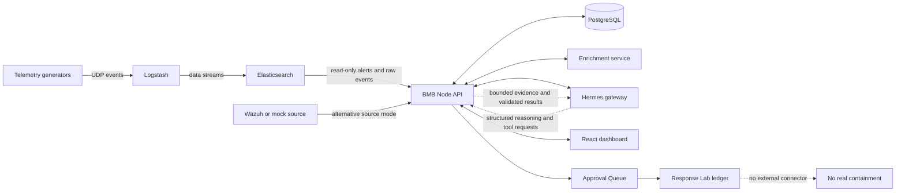

# BMB SOC Agent: Complete Architecture and Phase Guide

## 1. Purpose

This document explains how the BMB SOC Agent evolved from an early SOC dashboard prototype into an evidence-grounded, partially autonomous security-operations lab.

It focuses on the ideas needed to understand and present the system:

- what each phase added and why;
- how the main components communicate;
- how an Elastic alert becomes triage, correlation, an investigation, and a controlled response proposal;
- what Hermes does and what the BMB application still controls;
- which operations are automatic, which require approval, and which are simulations;
- what is real in the current internship lab and what is intentionally not implemented.

It does not repeat implementation details, source-code walkthroughs, historical command errors, or obsolete approaches.

> **Current scope:** The completed numbered architecture in this repository runs from Phase 0 through Phase 9. The coordinated telemetry generators and raw-event investigation capability are a final lab extension after Phase 9, not a separately documented Phase 10.

---

## 2. The project in one minute

BMB SOC Agent sits between security data and the analyst.

It reads alerts from Elastic Security, stores a normalized copy in PostgreSQL, adds internal context, asks Hermes to triage the evidence, groups related alerts into incidents, and creates durable investigation work. A background agent can perform safe internal workflow tasks and propose sensitive changes. Human approval remains mandatory for workflow ownership changes and every response simulation.

The most important architectural rule is:

> **Hermes reasons, but the BMB API controls.**

Hermes never receives database credentials, direct SQL authority, shell access, browser control, or unrestricted network tools. The BMB API decides what evidence can be read, validates every AI request, performs allowed operations, and records the result.

The Response Lab completes the demonstration lifecycle without pretending to perform real containment. It records what an endpoint isolation, identity suspension, or IP block decision would look like, but it does not modify EDR, Active Directory, a firewall, Elastic, email, or a ticketing platform.

---

## 3. Architecture at a glance



### The control boundary

```text
Security data and user requests
              |
              v
       BMB API policy layer
 authentication / validation / limits
 parameterized queries / persistence / audit
              |
       +------+------+
       |             |
       v             v
 PostgreSQL       Hermes
 authority        reasoning
```

PostgreSQL and the BMB API hold authoritative state. Hermes is an analysis and planning service, not the system of record and not an infrastructure administrator.

### Runtime topology

- Analysts open the nginx-served frontend on port 8080. nginx forwards `/api` requests to the API container.
- The API and PostgreSQL host ports are bound to loopback, reducing direct network exposure.
- The enrichment service is reachable only inside the Docker network.
- Hermes runs on the Linux server and is reached server-to-server through the Docker host gateway. A host bridge can expose a loopback-only Hermes gateway to the containers without exposing it to the wider network.
- Elasticsearch is reached over HTTPS with a mounted CA certificate and a read-only API key.
- Secrets remain in server configuration and are not sent to the browser or included in Hermes evidence.

---

## 4. Main components and responsibilities

| Component | What it does | What it does not do |
|---|---|---|
| **Elasticsearch / Elastic Security** | Stores generated or collected telemetry and Security alerts. | It is not written to by the SOC Agent. BMB uses read-only access. |
| **Logstash** | Receives UDP telemetry, assigns datasets, and indexes it into Elastic data streams. | It does not perform BMB triage or investigation logic. |
| **Node API** | Owns authentication, collection, normalization, enrichment orchestration, AI policy, tools, triage, correlation, workflow actions, approvals, and REST APIs. | It does not give Hermes arbitrary host or database access. |
| **PostgreSQL** | Stores alerts, incidents, investigations, cases, settings, AI runs, evidence links, actions, approvals, simulations, metrics, and audit history. | It is not an external SIEM and does not replace Elastic as the telemetry source. |
| **Enrichment service** | Supplies demonstration AD, CMDB, EDR, threat-intelligence, and vulnerability context. | Its bundled datasets are not live enterprise integrations. |
| **Hermes gateway** | Runs the configured AI model, handles structured runs, and reasons over evidence supplied through BMB. | It has no enabled host toolsets and cannot use shell, file, browser, or arbitrary web tools. |
| **React frontend** | Gives analysts the dashboard, alerts, incidents, AI triage, investigations, cases, approvals, Response Lab, settings, and chatbot. | It is not the source of truth for workflow state. Durable state lives on the server. |
| **Scheduler and autonomous worker** | Runs the collection-to-investigation pipeline at controlled intervals. | It cannot approve its own sensitive proposals or perform real containment. |
| **Telemetry generators** | Produce normal, alert, attack-chain, benign-admin, and policy-violation events for repeatable testing. | They are a lab data source, not actual employee activity. |

### Why Hermes is used instead of calling one model directly

Hermes gives the application one stable agent interface for runs, structured outputs, cancellation, sessions, and tool calls. The underlying model can be changed through the Hermes configuration as long as it supports the required contract. The BMB application therefore does not need a major redesign every time the model changes.

This does not mean Hermes is trusted with everything. BMB still owns the tools, permissions, evidence, writes, and approval rules.

---

## 5. The important records

These records represent different stages of SOC work and should not be confused:

| Record | Meaning |
|---|---|
| **Raw event** | A telemetry record such as a process start, logon, web request, or policy violation. It may not be a security alert. |
| **Alert** | A security detection selected from Elastic, Wazuh, or mock data and normalized into the BMB format. |
| **Triage result** | Hermes assessment of one alert: verdict, severity, confidence, attack stage, findings, recommendations, citations, and limitations. |
| **Incident** | A validated correlation of multiple alerts connected by identity, host, IP, and time. |
| **Investigation** | A durable workspace linking evidence and analyst/agent notes. It can exist for one alert or a correlated case. |
| **Case** | The analyst workflow view of an incident, including owner, status, and timeline notes. |
| **Action request** | A proposed internal workflow change or response simulation governed by the action policy. |
| **Approval** | A human decision to execute or deny a sensitive pending action. |
| **Response simulation** | An active or reverted BMB-only record representing a containment decision with zero external effects. |

This separation prevents a model recommendation from being treated as if it were an executed action.

---

## 6. End-to-end system behavior

### 6.1 Alert collection and storage

1. The scheduler or an administrator starts a collection cycle.
2. The API reads from the configured source: Elastic, Wazuh, or deterministic mock data.
3. Source-specific fields are converted into one common BMB alert structure.
4. Stable identifiers and database constraints prevent duplicate alerts.
5. New alerts are stored in PostgreSQL.
6. A persistent Elastic cursor can safely continue from the last processed position during scheduled collection.
7. Collection totals, duplicates, failures, timing, and later AI activity are recorded in the run history.

Elastic remains the external detection source. PostgreSQL stores the operational copy used by BMB workflows and AI provenance.

### 6.2 Enrichment

After storage, pending alerts are enriched with available identity, asset, EDR, threat-intelligence, and vulnerability context.

Only successfully enriched alerts can proceed into automated Hermes triage. This avoids making an AI decision while silently missing expected context.

### 6.3 Hermes triage

When triage is enabled:

1. The API selects an enriched pending alert.
2. It prepares bounded, normalized evidence.
3. Hermes produces a structured assessment, optionally using approved BMB evidence tools in agentic modes.
4. The API validates the response format and checks every citation against evidence actually supplied during that run.
5. A valid result is stored and linked to the alert and Hermes run.
6. A failed or ungrounded result becomes a triage failure; the system does not silently switch to another provider.

The available modes are:

- **Pipeline:** one bounded screening run; safest and least expensive.
- **Agentic:** Hermes may request a limited number of approved evidence lookups.
- **Hybrid:** starts with screening and escalates to agentic analysis only when deterministic risk rules require it.

### 6.4 Correlation

When correlation is enabled, the application selects newly triaged evidence and adds a bounded amount of recent context. Hermes proposes groups, but the API verifies that:

- every referenced alert exists;
- at least one newly triaged alert is included;
- the alerts share a valid entity-and-time chain;
- memberships are not duplicated or ambiguously assigned;
- severity and shared entities are recomputed from stored evidence.

Only validated groups become incidents. Stable incident identity lets a case grow as new connected alerts arrive without creating duplicate stories.

### 6.5 Autonomous investigation work

When autonomous orchestration is enabled, the worker runs after triage and correlation. It considers only bounded, recent, high-confidence high/critical evidence.

For qualifying evidence it can:

- create or reuse an investigation;
- link the supporting alerts;
- add a grounded investigation note;
- add a grounded case note;
- propose an owner for an unowned critical case;
- optionally propose one simulated response for a qualifying critical correlated case.

Every operation has a deterministic identity, so retrying a run does not duplicate completed investigations, notes, or requests. One failed candidate does not corrupt unrelated work.

### 6.6 Approval and Response Lab

Safe internal documentation actions requested by AI may execute directly. AI-requested ownership or workflow-state changes become pending requests. Every simulated containment action is also pending. An authenticated analyst can still manage ordinary workflow state through the normal dashboard controls.

The human workflow is:

1. The AI or an analyst submits an allowlisted action with evidence and a reason.
2. The action policy validates the target and parameters.
3. Sensitive actions appear in the Approval Queue.
4. An authenticated administrator reviews the preview and records an approve or deny reason.
5. Approval executes only the defined internal BMB operation.
6. An approved response simulation appears in Response Lab as active and internally verified.
7. Returning it to the reverted state requires a separate rollback request and approval.

No step calls an EDR, directory service, firewall, Elastic write API, email platform, or ticketing service.

### 6.7 Analyst chatbot

The chatbot is separate from the background agent. It answers interactive analyst questions.

1. The authenticated analyst asks a question.
2. The API loads a bounded amount of that analyst's conversation history.
3. Hermes may request approved evidence tools.
4. The API validates each request, performs a fixed lookup, redacts unsafe fields, and returns bounded evidence.
5. Hermes returns a structured answer with citations and limitations.
6. The API rejects citations that were not supplied during the run.
7. The conversation, tool traces, evidence, usage, and outcome are stored.

The chatbot can request controlled workflow actions, but it cannot bypass the same policy and approval boundary used by the autonomous worker.

### 6.8 Non-alert raw-event investigation

Not every important activity is a security detection. Playing an unauthorized game, visiting a prohibited website, or using PowerShell outside policy may require investigation without being malware.

The raw-event tool lets Hermes search recent Elastic `logs-*` evidence using exact, bounded pivots such as username, host, process, action, dataset, domain, or source IP. The API chooses the indices and fields; Hermes cannot submit arbitrary Elasticsearch queries.

Raw policy events stay outside the Alerts page unless an Elastic detection rule promotes them. They are still available as supporting evidence to the AI analyst.

---

## 7. Phase-by-phase evolution

### Phase 0 - Audit reality before adding automation

#### Problem

The original interface looked broader than the actual backend. Some functions were real, some were partial, and some changed only browser-local state. AI functionality was split between Hermes and direct model providers, while major authentication, migration, evidence, and audit controls were missing.

#### What the phase did

- Audited the repository and classified features as real, mock, partial, local-only, or unsafe.
- Identified defects in alert search, retriage, metrics, cache identity, health reporting, and automatic closure.
- Documented the intended Hermes migration and prioritized roadmap.

#### Why it mattered

It created an honest baseline. Later phases could improve real architecture instead of assuming every visible button already represented a safe server operation.

---

### Phase 1 - Secure and stabilize the foundation

#### Problem

An unauthenticated API, unreliable database upgrades, weak validation, and misleading health information were unsafe foundations for an AI agent.

#### What the phase did

- Added administrator login, signed sessions, CSRF protection, optional automation bearer authentication, rate limits, and security headers.
- Added versioned, idempotent database migrations protected by an advisory lock.
- Corrected alert lookup/retriage behavior and standardized validation and errors.
- Added accurate dependency health and durable pipeline metrics.
- Made source modes and TLS configuration explicit.
- Added repeatable tests and deterministic dependency installation.

#### Why it mattered

It established identity, reliable state, and truthful operations before giving AI access to more evidence or workflows.

---

### Phase 2 - Establish Hermes as the shared AI boundary

#### Problem

The chatbot used Hermes only as an optional path and could silently fall back to legacy providers. Runs, failures, citations, cancellation, and token usage did not share one durable contract.

#### What the phase did

- Added one shared Hermes Runs API integration for starting, polling, and stopping work.
- Verified capabilities, configured model, authentication, and the safe tool-less host profile.
- Removed silent chatbot fallback to other providers.
- Stored conversations, messages, runs, usage, evidence links, errors, and audit records.
- Propagated browser cancellation through the API to Hermes.

#### Why it mattered

Every later AI feature could reuse one observable, fail-closed integration instead of creating another provider-specific path.

---

### Phase 3 - Turn chat into a grounded SOC analyst

#### Problem

A fixed snapshot could omit relevant evidence. Sending a much larger snapshot would leak unnecessary data, cost more, and still provide weak provenance.

#### What the phase did

- Added bounded BMB-owned tools for alert, incident, identity, asset, EDR, threat-intelligence, vulnerability, and observable lookups.
- Added a structured investigation loop with tool, time, size, and iteration budgets.
- Added progress streaming to the UI.
- Required final citations to match evidence returned during the current run.
- Treated alert text as untrusted data to resist prompt injection.

#### Why it mattered

Hermes could investigate on demand without receiving SQL, database credentials, server access, or the entire SOC dataset.

---

### Phase 4 - Move automated alert triage to Hermes

#### Problem

Automated triage still called legacy model providers directly. Its cache did not fully represent the alert, enrichment, prompt, schema, and model that produced a verdict.

#### What the phase did

- Replaced direct-provider triage with Hermes-only pipeline, agentic, and hybrid modes.
- Required successful enrichment before triage.
- Enforced structured verdicts and exact input-alert citations.
- Bound cache reuse to the complete evidence and model identity.
- Isolated each triage run so retriage could not inherit hidden context.
- Kept automatic closure, response, and incident promotion disabled.

#### Why it mattered

Automated assessment now followed the same grounding, audit, and failure rules as the analyst chatbot.

---

### Phase 5 - Correlate alerts into incidents

#### Problem

Individual alerts did not reliably describe a multi-stage attack, and the old correlation path still depended on removed direct-provider logic.

#### What the phase did

- Moved correlation to Hermes using bounded candidate evidence and strict output.
- Kept candidate selection, entity/time validation, severity calculation, incident identity, database writes, and cursor safety inside BMB.
- Prevented fabricated IDs, disconnected groups, duplicate membership, and accidental reopening of closed or false-positive incidents.

#### Why it mattered

The system could build an attack story while treating model output as a proposal that must pass deterministic checks.

---

### Phase 6 - Make investigations and cases durable

#### Problem

Investigation notes, ownership, and workflow state stored only in a browser could disappear, could not be shared, and had no reliable author history.

#### What the phase did

- Moved investigations, evidence links, owners, statuses, and notes into PostgreSQL.
- Made incident-backed cases durable and collaborative.
- Added audit history for workflow mutations.
- Let Hermes read investigation and case context through bounded tools.

#### Why it mattered

The dashboard became a shared SOC workspace rather than a browser demonstration. It also created safe internal objects for later AI actions.

---

### Phase 7 - Add controlled AI workflow actions

#### Problem

The AI could analyze but could not safely contribute to workflow. Giving it arbitrary write access would have violated the trust model.

#### What the phase did

- Added one `request_soc_action` boundary with a strict action allowlist.
- Allowed reversible internal actions such as creating investigations and appending notes.
- Required approval for AI-requested investigation or case ownership/status changes.
- Added idempotency, transactional execution, decision locking, policy versioning, and complete audit history.
- Added the Approval Queue.

#### Why it mattered

Hermes became a workflow assistant without becoming a database administrator or infrastructure controller.

---

### Phase 8 - Add the proactive autonomous SOC worker

#### Problem

The chatbot acted only when asked. The system still needed a background process that could turn validated evidence into consistent investigation work.

#### What the phase did

- Added an opt-in worker after collection, enrichment, triage, and correlation.
- Applied severity, verdict, confidence, age, and work-limit qualification rules.
- Created or reused investigations and wrote grounded investigation/case notes.
- Proposed ownership for critical unowned cases instead of assigning them directly.
- Stored autonomous runs and retry-safe operations.

#### Why it mattered

The project became an agent rather than only a chatbot. It can perform useful internal SOC work continuously while remaining bounded and auditable.

---

### Phase 9 - Add approval-gated response simulation

#### Problem

The agent could investigate and document cases, but the lab could not safely demonstrate the response-decision lifecycle. Direct containment was inappropriate for the internship environment.

#### What the phase did

- Added evidence-bound endpoint isolation, identity suspension, and IP block simulations.
- Required approval before activation and a second approval before rollback.
- Added previews, active/reverted state, verification, event history, and audit records.
- Allowed the autonomous worker to propose one simulation for a qualifying critical correlated case when separately enabled.
- Explicitly recorded that external side effects are false.

#### Why it mattered

It demonstrates evidence, decision, approval, verification, reversibility, and audit without risking real systems or falsely claiming that containment occurred.

---

### Final lab extension - Realistic coordinated telemetry and raw evidence

#### Problem

Random alerts were not enough to prove correlation and autonomous behavior. The system also needed normal and policy-related events so the AI could show restraint instead of declaring everything malicious.

#### What the extension did

- Preserved the existing users, hosts, addresses, datasets, and generator inputs.
- Kept Security alerts at approximately 13-15% while normal events remain the majority.
- Added repeatable account-compromise, persistence, exfiltration, full-chain, policy, benign-admin, and mixed-enterprise stories.
- Shared usernames, hosts, source IPs, and campaign identifiers across attack stages so correlation has meaningful pivots.
- Added non-alert game, PowerShell, prohibited-site, and approved-maintenance events.
- Added bounded read-only raw-event evidence search for Hermes.

#### Why it mattered

The lab can now test both detection and judgment:

- correlate a real multi-stage generated story;
- distinguish a policy violation from malware;
- recognize an approved administrator action;
- use non-alert telemetry to support an investigation;
- maintain a realistic balance of normal and suspicious events.

---

## 8. What the AI can do now

### Interactive analyst capabilities

The chatbot can:

- summarize current SOC state;
- search and explain alerts;
- inspect incidents and their evidence;
- pivot on users, hosts, and IP addresses;
- retrieve identity, asset, EDR, threat-intelligence, vulnerability, and logon context;
- inspect bounded raw Elastic events, including non-alert policy evidence;
- explain uncertainty and cite the records it used;
- request allowed investigation, note, case, approval, and simulation workflows.

### Automated pipeline capabilities

When the corresponding settings are enabled, the system can automatically:

- collect new alerts;
- deduplicate and enrich them;
- triage alerts with Hermes;
- correlate connected alerts into incidents;
- create investigation workspaces;
- link evidence and add grounded notes;
- create approval requests for critical-case ownership;
- propose simulated containment for qualifying critical correlated cases.

### Human-only decisions

Humans still control:

- approval or denial of sensitive workflow updates;
- approval of every response simulation;
- approval of every rollback;
- interpretation and escalation outside the BMB application;
- any real-world containment performed manually in external systems.

### Capabilities the AI does not have

The AI cannot:

- run shell commands or code on the server;
- read or modify arbitrary files;
- browse arbitrary websites;
- submit SQL or arbitrary Elastic queries;
- obtain application secrets;
- isolate a real endpoint;
- disable a real identity;
- block a real IP or domain;
- quarantine email;
- close or modify Elastic alerts;
- approve its own action;
- silently change to a different AI provider when Hermes fails.

---

## 9. Automation controls

The architecture is capable of the full internal pipeline, but new databases default important automation switches to off. This is deliberate: deployment health and output quality should be accepted before unattended operation.

The main controls are independent:

| Control | Effect |
|---|---|
| **Scheduler enabled** | Runs collection periodically. |
| **Triage enabled** | Sends eligible enriched alerts to Hermes. |
| **Correlation enabled** | Groups eligible triaged alerts into incidents. |
| **Autonomous agent enabled** | Creates/reuses investigations and notes after triage/correlation. |
| **Simulation proposals enabled** | Allows the autonomous worker to submit pending response simulations for qualifying critical cases. |

Turning on the scheduler alone does not enable AI. Turning on the agent without valid triage/correlation evidence does not invent work. Each layer consumes validated output from the layer before it.

The safe operational order is:

```text
verify dependencies
  -> collect a controlled batch
  -> inspect normalization and enrichment
  -> enable and validate triage
  -> enable and validate correlation
  -> enable autonomous investigation work
  -> optionally enable simulation proposals
```

---

## 10. Security and reliability model

### Authentication

- The dashboard uses a signed HttpOnly session cookie.
- Browser writes require a CSRF token.
- Trusted scripts may use a separate bearer key.
- The current internship scope uses one administrator identity rather than full multi-user RBAC.

### Read-only Elastic access

- BMB reads the Security alert alias and approved raw-event index patterns.
- TLS verifies the Elastic certificate mounted into the API container.
- The Elastic API key has read and monitoring permissions needed by collection and health checks, not writeback privileges.

### Safe Hermes profile

- The Hermes gateway runs on the server and is authenticated.
- BMB checks the configured model, capabilities, and toolsets.
- Unsafe host tools cause the dependency check to fail closed.
- The Hermes credential stays on the backend.

### Grounding and prompt-injection resistance

- Tool names and arguments use strict schemas.
- Queries and result sizes are bounded.
- Evidence text is treated as data, not instruction.
- Raw payloads and secrets are withheld or redacted.
- Final citations must match evidence returned during the current run.

### Safe writes

- The action allowlist defines every AI-requestable mutation.
- Idempotency prevents retries from duplicating work.
- Sensitive actions remain pending until a human decision.
- Transactions and row locking prevent partial or double execution.
- Every run, tool call, action, approval, and simulation is auditable.

### Failure behavior

- Missing or unsafe Hermes fails closed.
- Failed enrichment does not enter triage.
- Invalid AI output is rejected rather than partially trusted.
- A failed candidate does not erase successful unrelated work.
- Collection cursors advance only after fetched alerts are safely inserted or recognized as duplicates.

---

## 11. Lab data and demonstration scenarios

The coordinated generator can send finite stories through the same Logstash and Elastic path used by the dashboard.

| Scenario | What it tests |
|---|---|
| **Account compromise** | Failed logons, successful access, and phishing tied to the same identity/source. |
| **Endpoint persistence** | Credential dumping followed by scheduled-task persistence. |
| **Exfiltration** | Large web and database exports linked to the compromised identity. |
| **Full attack chain** | Triage, multi-stage correlation, case creation, investigation notes, and possible simulation proposal. |
| **Policy violations** | Non-alert game, PowerShell, and prohibited-site evidence. |
| **Benign administrator** | Approved PowerShell maintenance that should not be called malicious. |
| **Mixed enterprise** | Attack behavior, acceptable-use violations, approved activity, and normal background noise together. |

The six generator streams remain EDR, email, Linux, Active Directory, web application, and database audit. Logstash converts them into Elastic `logs-*` data streams. Elastic detection alerts and raw events then serve different purposes:

- Security alerts drive the automated alert pipeline.
- Raw events support evidence gathering and careful analyst reasoning.

---

## 12. What appears in each main dashboard area

| Area | Purpose |
|---|---|
| **Overview** | Health, alert/case activity, scheduler state, and autonomous-agent progress. |
| **Alerts** | Individual and grouped normalized Security alerts with enrichment and triage state. |
| **AI Triage** | Pending and completed AI assessment activity. |
| **Incidents** | Correlated attack stories built from validated alert groups. |
| **Investigations** | Durable evidence workspaces and timelines. |
| **Cases** | Incident ownership, workflow state, and collaborative notes. |
| **Approvals** | Pending, executed, and denied controlled actions with exact reasons and parameters. |
| **Response Lab** | Active/reverted simulated responses, evidence, verification, and rollback history. |
| **Threat/Asset/Vulnerability views** | Context and pivots over stored and enrichment data. |
| **Settings** | Independent scheduler, triage, correlation, autonomous, and simulation controls. |
| **AI Analyst** | Interactive, grounded questions across approved evidence sources. |

Some broader UI areas, such as playbooks and integrations, are primarily presentation/configuration surfaces. The authoritative automated path is the collection, triage, correlation, investigation, approval, and simulation flow described above.

---

## 13. Current limitations and truthful final state

The project is intentionally sized for an internship lab rather than a production global SOC.

### Implemented and real inside the lab

- Dockerized API, frontend, PostgreSQL, and enrichment services.
- Authenticated dashboard and protected API.
- Read-only Elastic Security collection with verified TLS.
- Durable alert, incident, workflow, AI, approval, simulation, and audit records.
- Hermes-grounded chat, triage, and correlation.
- Autonomous internal investigation orchestration.
- Approval-gated, reversible response simulation.
- Coordinated Elastic telemetry scenarios and non-alert raw-event investigation.

### Intentionally limited

- The enrichment datasets are bundled lab data rather than live AD, CMDB, EDR, TIP, or vulnerability-platform connectors.
- Response Lab does not perform real containment.
- Elastic is read-only; BMB does not close or update Elastic alerts.
- There is one administrator role, not enterprise RBAC or separation of duties.
- Generated telemetry is realistic test data, not actual employee activity.
- Raw non-alert telemetry supports analyst questions but does not enter automated triage unless Elastic first promotes it to an alert.
- Automation must be enabled and validated through settings; capability does not mean every feature is always running.

These boundaries are strengths, not hidden failures. They keep the demonstration honest and safe.

---

## 14. How to explain the project

### Thirty-second explanation

> BMB SOC Agent reads Security alerts from Elastic, stores and enriches them, and uses Hermes to perform evidence-grounded triage and correlation. A background agent can create investigations and notes automatically, while sensitive changes go through a human approval queue. The Response Lab demonstrates containment decisions and rollback without touching real endpoints, accounts, or firewalls. The application, not the AI model, controls all data access and writes.

### Two-minute explanation

> We first audited and secured the SOC prototype, then created one reliable Hermes integration. We gave Hermes bounded read-only SOC tools so its answers and triage could be grounded in exact evidence. Next, we added validated correlation, durable investigations and cases, and a strict action policy. That policy allowed a proactive worker to create internal investigation work automatically but kept ownership and response decisions behind approval. Finally, Response Lab added reversible simulations for endpoint isolation, identity suspension, and IP blocking with zero external effects. Coordinated generators now produce realistic multi-stage attacks, benign administration, policy violations, and normal noise through Logstash and Elastic so the whole architecture can be demonstrated safely.

### The key sentence to remember

> **The AI proposes and reasons; BMB validates, records, and controls execution.**

---

## 15. Final architecture outcome

The final system is more than a chatbot attached to a dashboard. It is a layered SOC workflow:

```text
Telemetry
  -> detection collection
  -> normalized durable evidence
  -> enrichment
  -> grounded AI triage
  -> validated incident correlation
  -> durable investigations and cases
  -> autonomous internal workflow
  -> human approval
  -> reversible response simulation
```

The phases were deliberately ordered so that every increase in AI capability followed a stronger control:

- audit before automation;
- authentication before access;
- durable evidence before reasoning;
- read-only tools before triage;
- deterministic validation before correlation;
- server-owned workflows before AI writes;
- approval before sensitive changes;
- simulation before any future real connector.

That sequence is the central architectural lesson of the project.
