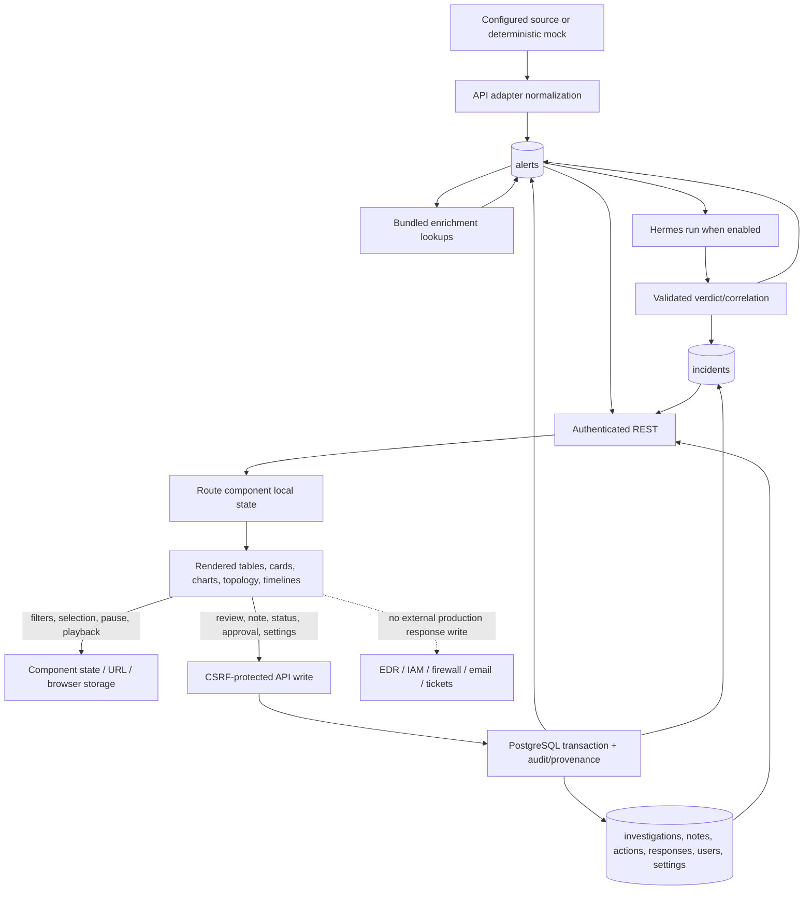

# API and Data

## Contract Status

The repository contains no TypeScript files, TypeScript interfaces, or PropTypes declarations. Backend domain contracts are defined through PostgreSQL DDL, AJV JSON schemas, route validation, and normalized JavaScript objects. Frontend topology and simulation contracts are the exception: they are declared as JSDoc typedefs and checked by runtime validators in `frontend/src/lib/securityVisualization.js`.

This file therefore reproduces the actual JSDoc, schema, object, and SQL contracts rather than inventing TypeScript interfaces.

## Data Model Reference

### Alert

Alert-source adapters normalize Elastic, Splunk, and Wazuh records to the PostgreSQL `alerts` shape. This is the actual Wazuh adapter return object; Elastic and Splunk add source-specific normalized fields before the pipeline persists the same canonical columns.

```js
return {
  id:          hit._id,
  timestamp:   s['@timestamp'] || s.timestamp || new Date().toISOString(),
  rule_id:     String(rule.id || ''),
  rule_level:  parseInt(rule.level || 0, 10),
  rule_desc:   rule.description || rule.comment || '',
  rule_groups: Array.isArray(rule.groups) ? rule.groups : [],
  decoder:     s.decoder?.name || null,
  agent_id:    s.agent?.id || null,
  agent_name:  s.agent?.name || null,
  full_log:    s.full_log || null,
  ...extractEntities(s),
  ...extractMitre(s),
  raw: s,
};
```

| Field | Description |
|---|---|
| `id` | Stable source record identifier and primary key. |
| `timestamp` | Source event or alert time. |
| `rule_id`, `rule_level`, `rule_desc`, `rule_groups` | Normalized detection rule identity, priority, title, and categories. |
| `decoder`, `agent_id`, `agent_name` | Source parser and endpoint-agent context where available. |
| `full_log` | Stored source message; withheld from bounded AI/public evidence tools where required. |
| `src_ip`, `dst_ip`, `username`, `hostname`, `process`, `target_db` | Normalized observable and affected-entity fields from `extractEntities`. |
| `mitre_techniques`, `mitre_tactics` | Source mappings or bounded deterministic fallback mappings. |
| `raw` | Stored original source document as JSONB. |
| `source_system`, `source_index`, `event_dataset`, `event_category`, `event_action` | Source provenance added by Elastic/Splunk normalization and persistence. |
| `source_severity`, `risk_score`, `workflow_status`, `alert_reason` | Source-native prioritization and workflow context. |
| `group_key`, `occurrence_count`, `first_seen`, `last_seen` | Repeated-alert grouping identity and time/count summary. |
| `enrichment`, `enrichment_status`, `enrichment_error`, `enriched_at` | Bundled enrichment result and processing state. |
| `verdict`, `triage_status`, `triage_error`, `triaged_at`, `triage_run_id` | Validated Hermes triage result and provenance. |
| `fetch_run_id`, `signature`, `fetched_at`, `updated_at` | Collection/deduplication lifecycle fields. |
| `auto_closed`, `auto_close_reason` | Legacy columns; server policy keeps automatic closure disabled. |

### Triage Verdict

The final branch of the actual AJV `triageTurn` schema requires these fields and rejects additional properties. This is the executable schema excerpt from `api/src/services/hermes/schemas.js`:

```js
{
  type: 'object',
  required: [
    'type', 'severity', 'verdict', 'confidence', 'attack_stage',
    'key_findings', 'recommended_actions', 'narrative', 'citations',
  ],
  properties: {
    type: { const: 'final' },
    severity: { enum: TRIAGE_SEVERITIES },
    verdict: { enum: TRIAGE_VERDICTS },
    confidence: { type: 'number', minimum: 0, maximum: 1 },
    attack_stage: { type: 'string', minLength: 1, maxLength: 100 },
    key_findings: {
      type: 'array', minItems: 1, maxItems: 8,
      items: { type: 'string', minLength: 1, maxLength: 500 },
    },
    recommended_actions: {
      type: 'array', minItems: 1, maxItems: 8,
      items: { type: 'string', minLength: 1, maxLength: 500 },
    },
    narrative: { type: 'string', minLength: 1, maxLength: 3000 },
    citations: {
      type: 'array', minItems: 1, maxItems: 20,
      items: {
        type: 'object', required: ['type', 'id'],
        properties: {
          type: { enum: EVIDENCE_TYPES },
          id: { type: 'string', minLength: 1, maxLength: 256 },
        },
        additionalProperties: false,
      },
    },
    limitations: {
      type: 'array', maxItems: 8,
      items: { type: 'string', minLength: 1, maxLength: 500 },
    },
  },
  additionalProperties: false,
}
```

The object above is a readable projection of `api/src/services/hermes/schemas.js`; accepted lengths, item limits, evidence-type enumeration, and numeric bounds are enforced by AJV. `confidence` is model output in `[0, 1]`, not randomized frontend data. Citations are post-validated against evidence supplied to the run.

### Incident and Correlation Proposal

Hermes proposes incident groups with this enforced shape: title, severity, confidence, 2–80 unique `alert_ids`, up to 12 `attack_stages`, `common_entities.users/hosts/ips`, narrative, and 1–8 recommended actions. The API then independently validates membership, shared entities, time connectivity, severity, and stable incident identity before writing `incidents`.

The durable incident fields come directly from `api/src/db/migrations/001_current_schema.sql` and later migrations:

```sql
CREATE TABLE IF NOT EXISTS incidents (
  id SERIAL PRIMARY KEY,
  incident_key TEXT UNIQUE NOT NULL,
  title TEXT,
  severity TEXT,
  confidence FLOAT,
  attack_stages TEXT[] DEFAULT '{}',
  common_entities JSONB DEFAULT '{}',
  alert_ids TEXT[] NOT NULL,
  narrative TEXT,
  recommended_actions TEXT[] DEFAULT '{}',
  first_seen TIMESTAMPTZ,
  last_seen TIMESTAMPTZ,
  status TEXT DEFAULT 'open' CHECK (status IN ('open','closed','false_positive')),
  fetch_run_id INTEGER,
  incident_type TEXT DEFAULT 'correlation',
  created_at TIMESTAMPTZ DEFAULT NOW(),
  updated_at TIMESTAMPTZ DEFAULT NOW()
);
```

Later migrations add `correlation_run_id`, `owner`, `first_response_at`, and `resolved_at`. A Case is not a separate table: the case workflow is the incident record plus `owner`, status, and append-only `case_notes`.

### Investigation

```sql
CREATE TABLE IF NOT EXISTS investigations (
  id UUID PRIMARY KEY DEFAULT uuid_generate_v4(),
  title TEXT NOT NULL CHECK (char_length(title) BETWEEN 1 AND 200),
  search_query TEXT NOT NULL DEFAULT '' CHECK (char_length(search_query) <= 500),
  status TEXT NOT NULL DEFAULT 'open' CHECK (status IN ('open','closed')),
  owner TEXT CHECK (owner IS NULL OR char_length(owner) <= 120),
  created_by TEXT NOT NULL,
  created_at TIMESTAMPTZ NOT NULL DEFAULT NOW(),
  updated_at TIMESTAMPTZ NOT NULL DEFAULT NOW()
);
```

`investigation_alerts` is the many-to-many evidence membership table. `investigation_notes` stores 1–4,000 character append-only notes with author and timestamp.

### Controlled Action and Approval

`action_requests` stores a policy-versioned proposed operation, target, requested actor, reason, status, idempotency key, preview, approval/execution timestamps, and result/error. Supported action types after migration 009 are:

```js
[
  'investigation.create',
  'investigation.add_note',
  'case.add_note',
  'investigation.update',
  'case.update',
  'response.simulate',
  'response.rollback'
]
```

The first three internal low-risk operations may execute under policy; investigation/case updates and both response operations use the approval boundary. `action_approvals` records the authenticated decision and reason. No allowed action writes to an external EDR, identity, firewall, email, Elastic, or ticketing system.

### Simulated Response

```sql
CREATE TABLE IF NOT EXISTS simulated_response_states (
  id UUID PRIMARY KEY DEFAULT uuid_generate_v4(),
  response_type TEXT NOT NULL CHECK (response_type IN (
    'endpoint_isolate','identity_suspend','ip_block'
  )),
  target_value TEXT NOT NULL,
  state TEXT NOT NULL DEFAULT 'active' CHECK (state IN ('active','reverted')),
  evidence_alert_ids TEXT[] NOT NULL,
  action_request_id UUID NOT NULL UNIQUE REFERENCES action_requests(id),
  executed_by TEXT NOT NULL,
  executed_at TIMESTAMPTZ NOT NULL DEFAULT NOW(),
  verified_at TIMESTAMPTZ,
  verification JSONB,
  rollback_action_request_id UUID UNIQUE REFERENCES action_requests(id),
  reverted_by TEXT,
  reverted_at TIMESTAMPTZ,
  created_at TIMESTAMPTZ NOT NULL DEFAULT NOW(),
  updated_at TIMESTAMPTZ NOT NULL DEFAULT NOW()
);
```

`simulated_response_events` stores `executed`, `verified`, and `reverted` events. Verification proves only BMB's internal state transition.

### Analyst Decision Review

```sql
CREATE TABLE IF NOT EXISTS analyst_decision_reviews (
  id BIGSERIAL PRIMARY KEY,
  entity_type TEXT NOT NULL CHECK (entity_type IN ('alert','incident')),
  entity_id TEXT NOT NULL,
  decision TEXT NOT NULL CHECK (decision IN (
    'confirmed','challenged','needs_more_evidence'
  )),
  reason TEXT NOT NULL CHECK (char_length(reason) BETWEEN 10 AND 1000),
  actor TEXT NOT NULL,
  created_at TIMESTAMPTZ NOT NULL DEFAULT NOW()
);
```

Reviews are append-only and do not overwrite the underlying AI verdict. `/workflow-quality` aggregates review coverage and agreement; it does not claim model accuracy.

### Agent Run and Evidence Provenance

| Record | Purpose |
|---|---|
| `agent_conversations`, `agent_messages` | Durable authenticated chat threads and messages. |
| `agent_runs` | Parent/sub-run identity, workflow, status, provider/model, token usage, latency, error, and output. |
| `agent_run_steps` | Ordered grounded analyst/Hermes steps. |
| `agent_tool_calls` | Validated BMB application-tool request/result traces. |
| `agent_evidence_links` | Run-to-evidence citations across alert, incident, workflow, action, raw-event, and response records. |
| `workflow_stage_events` | Append-only collected → normalized → enriched → triaged → correlated → incident-decision ledger. |
| `autonomous_runs`, `autonomous_operations` | Opt-in workflow-assistance passes and idempotent internal operations. |
| `audit_events` | Actor, event type, target, outcome, request ID, and metadata for administrative/workflow actions. |

### User

`app_users` stores `id`, case-insensitive unique `username`, `display_name`, fixed `role`, scrypt `password_hash`, `active`, `session_version`, creator, timestamps, and `last_login_at`. Public session responses omit the password hash. Roles are `executive`, `soc_analyst`, and `administrator`.

### Visualization and Scenario JSDoc Types

These are the actual public JSDoc declarations from `frontend/src/lib/securityVisualization.js`:

```js
/**
 * @typedef {Object} NetworkNode
 * @property {string} id
 * @property {string} label
 * @property {string} sublabel
 * @property {NetworkNodeType} type
 * @property {NetworkNodeState} state
 * @property {{x:number, y:number}} position
 *
 * @typedef {Object} NetworkEdge
 * @property {string} id
 * @property {string} sourceNodeId
 * @property {string} targetNodeId
 * @property {NetworkEdgeState} state
 *
 * @typedef {Object} AttackEvent
 * @property {string} id
 * @property {string} timestamp
 * @property {string} message
 * @property {AttackEventType} eventType
 * @property {'critical'|'high'|'medium'|'low'} severity
 * @property {string} affectedNodeId
 * @property {string|null} affectedEdgeId
 *
 * @typedef {Object} MitreStage
 * @property {string} id
 * @property {string} tacticName
 * @property {string|null} techniqueId
 * @property {MitreStageState} state
 *
 * @typedef {Object} SimEvent
 * @property {string} id
 * @property {number} timestampOffset
 * @property {string} message
 * @property {string} relatedStageId
 * @property {string} eventType
 *
 * @typedef {Object} Scenario
 * @property {string} id
 * @property {string} name
 * @property {string} description
 * @property {string} icon
 * @property {MitreStage[]} killChainStages
 * @property {SimEvent[]} scriptedEvents
 */
```

| Type | Field notes |
|---|---|
| `NetworkNode` | Identifies a rendered entity, presentation labels, allowed node type/state, and fixed canvas coordinates. |
| `NetworkEdge` | Connects two known node IDs and carries `idle`, `active-traversal`, or `traversed` state. |
| `AttackEvent` | ISO-timestamped event bound to a known node and optional edge with an allowed severity/type. |
| `MitreStage` | Tactic/technique display node with `upcoming`, `in-progress`, `completed`, or `blocked` state. |
| `SimEvent` | Relative-timed training event linked to a scenario stage. |
| `Scenario` | Hardcoded training definition containing an ordered kill chain and scripted events. |

The exported validators reject missing IDs, duplicate IDs, invalid enumerations, invalid coordinates/timestamps, and references to unknown nodes, edges, or stages.

## PostgreSQL Record Inventory

| Table | Primary data | Source of writes |
|---|---|---|
| `settings` | Collection, AI, correlation, autonomous, simulation, and retention policy | Migrations and administrator routes |
| `alerts` | Normalized source evidence, enrichment, triage, grouping, MITRE, and provenance | Pipeline worker |
| `incidents` | Correlated groups, status, owner, narrative, milestones | Correlation worker and analyst routes |
| `fetch_runs` | Collection/processing run metrics | Pipeline and scheduler |
| `triage_cache` | Evidence/model-bound successful verdict cache | Triage worker |
| `investigations`, `investigation_alerts`, `investigation_notes` | Analyst evidence workspaces | Analyst and autonomous internal workflows |
| `case_notes` | Append-only notes attached to incident-backed cases | Analyst and autonomous internal workflows |
| `action_requests`, `action_approvals` | Controlled change proposals and human decisions | Analyst/autonomous workflow and approval queue |
| `simulated_response_states`, `simulated_response_events` | Internal reversible response rehearsals | Approved controlled actions |
| `agent_*` tables | Chat/triage/correlation run, step, tool, evidence, and usage audit | Hermes adapter and workflow store |
| `workflow_stage_events` | Cross-stage provenance ledger | Pipeline and correlation workflow |
| `analyst_decision_reviews` | Human confirmation/challenge records | Alert and incident review components |
| `autonomous_runs`, `autonomous_operations` | Opt-in workflow-assistance execution history | Autonomous worker |
| `audit_events` | Administrative and workflow audit trail | Auth, settings, users, connectors, actions, and workers |
| `app_users` | Managed fixed-role account directory | Bootstrap and administrator routes |
| `source_connectors` | Connector metadata, encrypted secrets, test and cursor state | Administrator connector routes |
| `business_service_mappings` | Seeded CMDB/event-to-business-service taxonomy | Migration seed |
| `alert_retention_runs` | Dry-run and destructive policy-run ledger | Retention service |
| `schema_migrations` | Applied migration versions | Migration runner |

## Data Source Inventory

| Data Type / Consumer | Source | File location | Notes |
|---|---|---|---|
| Elastic alerts and raw-event pivots | Live API when configured | `api/src/services/elastic.js` | Read-only API key; cursor required for automatic collection. No Elastic writeback. |
| Splunk alerts and raw-event pivots | Live API when configured | `api/src/services/splunk.js` | Export API with bounded search/time and configured index or triggered-alert allowlist. |
| Wazuh alerts | Live API when `WAZUH_MODE` is not `mock` | `api/src/services/wazuh.js` | HTTPS/HTTP Indexer search with basic authentication. |
| Safe local alerts | Hardcoded in service | `api/src/services/wazuh.js` (`makeMock`) | Four stable deterministic records; `ALERT_SOURCE=mock` still routes through this adapter. |
| AD identities/groups | Mock JSON | `enrichment/data/ad_users.json`, `ad_groups.json` | Loaded into memory at enrichment startup. |
| CMDB assets | Mock JSON | `enrichment/data/cmdb_assets.json` | Loaded into memory; also used to derive business context. |
| EDR agents/detections | Mock JSON | `enrichment/data/edr_agents.json`, `edr_detections.json` | Context only; no EDR action connector. |
| Threat indicators | Mock JSON | `enrichment/data/tip_indicators.json` | Lookup context and confidence. |
| Vulnerability findings | Mock JSON | `enrichment/data/vuln_findings.json` | Lookup context; not a live scanner feed. |
| Alerts, incidents, workflows, users, settings, audit | PostgreSQL | `api/src/db/migrations/*.sql` | Durable backend data. |
| Executive business-service mapping | Seeded database taxonomy | `api/src/db/migrations/011_executive_metrics.sql` | Static mapping seed, then durable table. |
| Live Monitoring | REST from PostgreSQL plus collector status | `frontend/src/pages/LiveMonitoring.jsx` | Polls grouped/individual alerts and collector every 15 s. |
| Security Analytics | REST aggregate from PostgreSQL | `frontend/src/pages/SOCAnalytics.jsx` | Polls `/analytics/security` every 60 s. |
| Triage and AI Triage | REST from PostgreSQL/Hermes workflow records | `frontend/src/pages/Alerts.jsx`, `AITriage.jsx` | Verdicts are real stored results when Hermes ran; otherwise pending. Saved view/pins are localStorage. |
| Incidents, Investigations, Cases | REST from PostgreSQL | `frontend/src/pages/Incidents.jsx`, `Investigations.jsx`, `Cases.jsx` | Status, owner, evidence membership, reviews, and notes are durable; containment acknowledgements on Incidents are session-only. |
| Digital Twin | Computed from latest 100 stored alerts | `frontend/src/pages/DigitalTwin.jsx`, `frontend/src/lib/securityVisualization.js` | Derived topology and local animated event stream; not a live network topology source. |
| Attack Simulator training | Hardcoded in frontend | `frontend/src/lib/attackSimulation.js` | Three scripted scenarios and timer-driven playback. |
| Attack Simulator replay | REST from stored alerts/journey | `frontend/src/components/attack-simulator/AlertReplayWorkspace.jsx` | Reconstructs recorded alert/AI phases; does not execute attack traffic. |
| MITRE incident/coverage | REST aggregates from stored incidents/alerts | `api/src/services/mitre.js`, `frontend/src/pages/MitreCoverage.jsx` | Both Incident and Coverage views are implemented. |
| Assets and Vulnerabilities | Computed from latest 100 stored alerts/enrichment | `frontend/src/pages/Assets.jsx`, `Vulnerabilities.jsx` | Evidence sample, not full inventory. |
| Entity Intelligence | REST pivot plus local watchlist | `frontend/src/pages/ThreatIntelligence.jsx` | Pivot is server-backed; watchlist key `bmb-threat-watchlist` is localStorage. |
| Playbooks | Hardcoded plus localStorage | `frontend/src/pages/Playbooks.jsx` | Key `bmb-playbook-runs`; no server audit or execution. |
| Reports | Live PDF generation from PostgreSQL | `api/src/services/reports.js` | Downloaded through authenticated `/api/reports/*`. |
| Approval Queue / Responses | REST from PostgreSQL | `frontend/src/pages/Approvals.jsx`, `Responses.jsx` | Durable internal approvals and simulations only. |
| Integrations / Collector / AI / Users / Audit / Retention / Settings | REST from runtime config and PostgreSQL | Administrator pages under `frontend/src/pages` | Configuration and audit are real; reachability depends on deployed external services. |
| Theme | LocalStorage | `frontend/src/App.jsx` | Key `bmb-theme`. |
| Chat conversation ID | SessionStorage | `frontend/src/components/ChatWidget.jsx` | Scoped by account/role; messages and runs are also durable server-side. |
| Health-warning dismissal | SessionStorage | `frontend/src/components/ui/HeaderStatusChip.jsx` | Key `bmb-health-chip-collapsed`. |

## API Endpoints

### Authentication, Errors, and Authorization

The API is real and implemented under `/api`. `POST /api/auth/login` and `GET /api/health` are public. Other routes accept the signed HttpOnly session or optional bearer API key. Session-authenticated writes require `X-CSRF-Token`; bearer-authenticated writes do not use browser CSRF. Errors are returned as `{ error: { code, message, request_id } }`.

Shape names in the tables refer to the models above or to a self-describing JSON object returned by the route. `Paged<T>` includes page/limit/total plus the named record array.

### Core, Alert, Analytics, MITRE, and Reports

| Method | Endpoint | Purpose | Request shape | Response shape | Auth required |
|---|---|---|---|---|---|
| POST | `/api/auth/login` | Create signed session | `{ username, password }` | `{ user, csrf }` | No |
| GET | `/api/auth/session` | Revalidate current account | — | `{ user, csrf }` | Session/bearer |
| POST | `/api/auth/logout` | Clear session cookie | Empty JSON | `{ ok }` | Session/bearer; CSRF for session |
| GET | `/api/health` | API process health | — | `{ status, ts }` | No |
| GET | `/api/health/dependencies` | Database, enrichment, Hermes, and source reachability | — | Dependency status object | Any authenticated role |
| GET | `/api/collector/status` | Collection configuration and recent runs | — | Collector status object | Any authenticated role |
| GET | `/api/alerts` | Search individual alerts | Pagination; search, severity, status, source, time filters | `Paged<Alert>` | Analyst/admin |
| GET | `/api/alert-groups` | Search grouped alert activity | Pagination and group filters | `Paged<AlertGroup>` | Analyst/admin |
| GET | `/api/alerts/critical` | Bounded critical-alert list | Query limits | Alert list | Analyst/admin |
| GET | `/api/alerts/:id` | Full normalized alert detail | Path ID | `Alert` | Analyst/admin |
| GET | `/api/alerts/:id/journey` | Alert workflow provenance and reviews | Path ID | Stage/run/review journey | Analyst/admin |
| POST | `/api/alerts/:id/retriage` | Reset and run one alert through triage | Path ID | Queue/run result | Analyst/admin; CSRF |
| GET | `/api/incidents` | List incidents | Status and pagination | `Paged<Incident>` | Analyst/admin |
| GET | `/api/incidents/:id` | Incident with member evidence | Path ID | `Incident` plus alerts | Analyst/admin |
| GET | `/api/incidents/:id/journey` | Correlation and decision provenance | Path ID | Incident journey | Analyst/admin |
| PATCH | `/api/incidents/:id` | Change incident status/owner | Allowlisted fields | Updated `Incident` | Analyst/admin; CSRF |
| GET | `/api/pivot` | Search exact indicator relationships | `indicator` query | Alerts/incidents/entity context | Analyst/admin |
| GET | `/api/analytics/security` | Evidence-backed analytics aggregates | `hours=24|168|720` | Trend, severities, rankings, tactics | Analyst/admin |
| GET | `/api/mitre/incidents` | MITRE incident directory | Bounded `limit` | Incident summaries | Analyst/admin |
| GET | `/api/mitre/incidents/:id` | ATT&CK matrix/timeline incident detail | Path ID | Incident, tactics, alerts | Analyst/admin |
| GET | `/api/mitre/coverage` | Aggregate tactic coverage and gaps | `range=7|30|90` | Tactics and summary | Analyst/admin |
| GET | `/api/stats` | Alert/pipeline summary | — | Counts/status summary | Analyst/admin |
| GET | `/api/runs` | Collection run history | Pagination | `Paged<FetchRun>` | Analyst/admin |
| GET | `/api/reports/alerts` | Stream alert PDF | Hours; optional `detailed=true` | PDF attachment | Summary: executive/analyst/admin; detailed: analyst/admin |
| GET | `/api/reports/incidents` | Stream incident PDF | Optional `detailed=true` | PDF attachment | Summary: executive/analyst/admin; detailed: analyst/admin |
| GET | `/api/reports/incidents/:id` | Stream one detailed incident PDF | Path ID | PDF attachment | Analyst/admin |

### Workflows, Reviews, Actions, Responses, and Chat

| Method | Endpoint | Purpose | Request shape | Response shape | Auth required |
|---|---|---|---|---|---|
| GET | `/api/investigations` | List durable investigations | Pagination/status | `Paged<Investigation>` | Analyst/admin |
| POST | `/api/investigations` | Create evidence-bound investigation | Title, search query, alert IDs | `Investigation` | Analyst/admin; CSRF |
| GET | `/api/investigations/:id` | Load investigation, evidence, and notes | Path UUID | Investigation detail | Analyst/admin |
| PATCH | `/api/investigations/:id` | Update owner/status/title | Allowlisted fields | Updated investigation | Analyst/admin; CSRF |
| DELETE | `/api/investigations/:id` | Delete investigation record | Path UUID | `{ ok }` | Analyst/admin; CSRF |
| POST | `/api/investigations/:id/notes` | Append note | `{ body }` | Note | Analyst/admin; CSRF |
| GET | `/api/cases` | List incident-backed cases | Pagination/status | `Paged<Case>` | Analyst/admin |
| GET | `/api/cases/:id` | Load case with alerts/notes | Incident ID | Case detail | Analyst/admin |
| PATCH | `/api/cases/:id` | Update case owner/status | Allowlisted fields | Updated case | Analyst/admin; CSRF |
| POST | `/api/cases/:id/notes` | Append case note | `{ body }` | Note | Analyst/admin; CSRF |
| POST | `/api/workflow-reviews` | Record append-only alert/incident review | Entity, decision, reason | Review | Analyst/admin; CSRF |
| GET | `/api/workflow-quality` | Aggregate review coverage/agreement | `days=7|30|90` | Quality summary | Analyst/admin |
| GET | `/api/action-policy` | Read allowlisted controlled actions | — | Policy/version | Analyst/admin |
| GET | `/api/actions` | List action requests | Status/pagination | `Paged<ActionRequest>` | Analyst/admin |
| GET | `/api/actions/:id` | Load one request and decision | Path UUID | Action detail | Analyst/admin |
| POST | `/api/actions` | Propose supported action | Action type, target, evidence, reason | Action request | Analyst/admin; CSRF |
| POST | `/api/actions/:id/decision` | Approve or deny pending request | `{ decision, reason }` | Updated/executed result | Analyst/admin; CSRF |
| GET | `/api/responses` | List response simulations | State/type/pagination | `Paged<SimulatedResponse>` | Analyst/admin |
| GET | `/api/responses/:id` | Load simulation and event history | Path UUID | Response detail | Analyst/admin |
| POST | `/api/responses/simulate` | Request response simulation | Type, target, evidence, reason | Pending action request | Analyst/admin; CSRF |
| POST | `/api/responses/:id/rollback` | Request simulation rollback | `{ reason }` | Pending action request | Analyst/admin; CSRF |
| POST | `/api/chat/stream` | Stream bounded grounded analyst progress | Message, conversation/history/page context | NDJSON events then result | Authenticated role; CSRF |
| POST | `/api/chat` | Non-streaming grounded analyst call | Same bounded chat input | Validated chat result | Authenticated role; CSRF |

### Scheduler, Autonomous Worker, and Settings

| Method | Endpoint | Purpose | Request shape | Response shape | Auth required |
|---|---|---|---|---|---|
| GET | `/api/settings` | Read allowlisted platform settings | — | `{ settings }` | Admin only |
| PUT | `/api/settings` | Atomically update allowlisted settings | Key/value object | Changed settings | Admin; CSRF |
| GET | `/api/scheduler/status` | Scheduler and worker state | — | Status object | Admin only |
| POST | `/api/scheduler/run-now` | Run collection/processing cycle | Empty JSON | Run result | Admin; CSRF |
| POST | `/api/scheduler/enrich-pending` | Enrich stored pending alerts | Empty JSON/options | Batch result | Admin; CSRF |
| POST | `/api/scheduler/triage-pending` | Triage stored pending alerts | Bounded options | Batch result | Admin; CSRF |
| POST | `/api/scheduler/correlate-now` | Run bounded correlation pass | Empty JSON/options | Correlation result | Admin; CSRF |
| GET | `/api/agent/status` | Autonomous worker readiness/history | — | Status and operations | Any authenticated role, role-filtered UI |
| GET | `/api/agent/operations/:id` | Load operation details | Path ID | Operation | Role access enforced |
| POST | `/api/agent/run-now` | Run opt-in workflow assistance | Empty JSON/options | Autonomous run result | Admin; CSRF |

### Administration and Managed Connectors

All endpoints below require the `administrator` role; writes also require CSRF for session authentication.

| Method | Endpoint | Purpose | Request shape | Response shape |
|---|---|---|---|---|
| GET | `/api/admin/runtime` | Redacted runtime configuration | — | Runtime summary without secrets |
| GET | `/api/admin/ai-models` | List allowlisted model profiles and active route | — | Model profile inventory |
| PUT | `/api/admin/ai-model` | Activate one allowlisted profile | `{ profile_id }` | Updated inventory |
| POST | `/api/admin/ai-models/test` | Bounded route connectivity test | `{ profile_id }` | Test result |
| GET | `/api/admin/users` | List managed accounts | — | Public user list |
| POST | `/api/admin/users` | Create fixed-role account | Username, display name, role, password | Public user |
| DELETE | `/api/admin/users/:id` | Remove account, with last/self-admin safeguards | Path ID | Removed-user summary |
| GET | `/api/admin/audit-events` | Filter bounded governance feed | Actor, type, outcome, pagination | Audit event list |
| GET | `/api/admin/data-governance` | Stored coverage and retention status | — | Governance inventory |
| POST | `/api/admin/data-governance/retention/preview` | Count policy candidates/protected records | Policy options | Dry-run result |
| POST | `/api/admin/data-governance/retention/run` | Execute confirmed retention policy | Policy plus exact confirmation | Durable run result |
| GET | `/api/admin/connectors` | List redacted connector metadata | — | Connector inventory |
| POST | `/api/admin/connectors` | Create encrypted connector | Name, type, config, secret | Redacted connector |
| PATCH | `/api/admin/connectors/:id` | Update connector configuration/secret | Allowlisted partial fields | Redacted connector |
| POST | `/api/admin/connectors/:id/test` | Run bounded read-only connection test | Empty JSON | Test result |
| POST | `/api/admin/connectors/:id/activate` | Make tested connector active | Empty JSON | Connector inventory/result |
| POST | `/api/admin/connectors/:id/disable` | Disable connector | Empty JSON | Updated connector |
| DELETE | `/api/admin/connectors/:id` | Remove connector | Path UUID | `{ ok }` |

### Internal Enrichment Service

The enrichment container is not published to the host by `docker-compose.yml`; the API calls it at `http://enrichment:3001`.

| Method | Endpoint | Purpose | Data source |
|---|---|---|---|
| GET | `/health` | Dataset counts and process health | In-memory bundled JSON |
| GET | `/ad/users/:sam` | Identity lookup | `ad_users.json` |
| POST | `/ad/logon-check` | Recent logon context | `ad_users.json` |
| GET | `/cmdb/by-hostname/:hostname` | Asset lookup | `cmdb_assets.json` |
| GET | `/cmdb/by-ip/:ip` | Asset lookup | `cmdb_assets.json` |
| GET | `/edr/agent/:hostname` | EDR agent lookup | `edr_agents.json` |
| GET | `/edr/detections/:hostname` | Recent detections | `edr_detections.json` |
| GET | `/tip/:value` | Indicator lookup | `tip_indicators.json` |
| POST | `/tip/bulk` | Bounded indicator lookup | `tip_indicators.json` |
| GET | `/vuln/:hostname/risk` | Host vulnerability context | `vuln_findings.json` |
| POST | `/enrich` | Composite context for one alert | All applicable bundled datasets |

## State Management and Data Flow



---

Last updated: 2026-08-26 — generated by full codebase review of adapters, AJV schemas, route validation, SQL migrations, frontend consumers, tests, and Graphify results.
