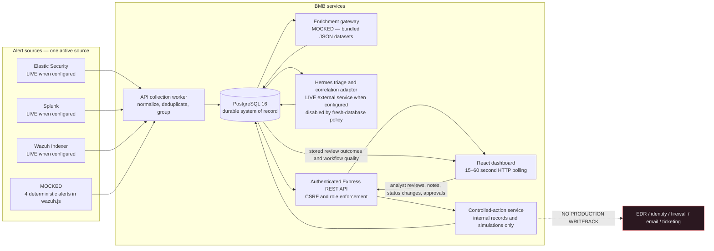
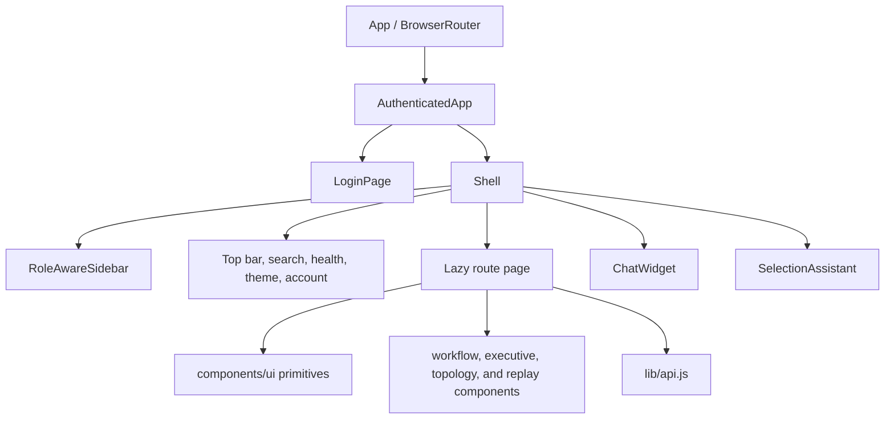
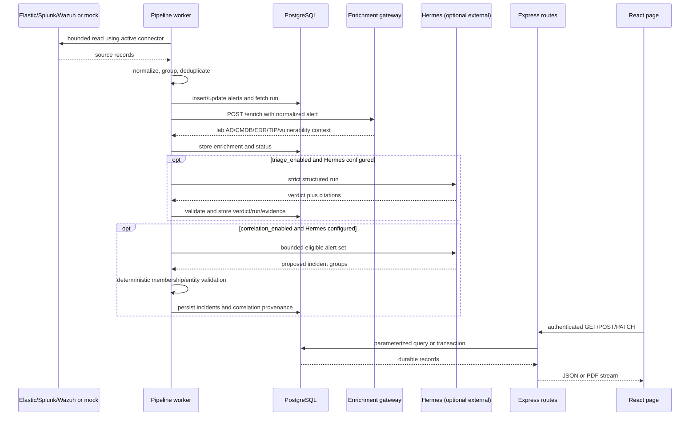

# Architecture

## System Overview

The API chooses a dashboard-managed connector first, then `ALERT_SOURCE`, then the `settings.alert_source` database value. Collection and PostgreSQL persistence do not require AI. Enrichment reads bundled lab datasets; Hermes is a separately operated authenticated service and is not part of this repository.

## Service Boundaries

| Service | Active entrypoint | Responsibility | Durable state |
|---|---|---|---|
| Frontend | `frontend/src/main.jsx` → `frontend/src/App.jsx` | Role-specific workspaces, polling, local interaction state, downloads, chat stream client | Theme, saved alert view, pins, watchlist, playbook progress, and conversation ID use browser storage; domain records are server-backed |
| API | `api/src/index.js` | Authentication, authorization, REST contracts, collection, enrichment orchestration, triage, correlation, reports, retention, approvals, and simulations | PostgreSQL |
| Enrichment | `enrichment/src/index.js` | Bounded lookup API for AD, CMDB, EDR, TIP, and vulnerability context | Bundled JSON loaded into process memory |
| Database | `postgres:16-alpine` | System of record and migration ledger | Named Compose volume `postgres_data` |
| Hermes | External to repository | Structured chat, triage, and correlation model execution | BMB stores run, step, usage, evidence, and result records in PostgreSQL |
| nginx | `frontend/nginx.conf` | Static SPA hosting and `/api` reverse proxy | None |

## Frontend Architecture

### Routing and Role Enforcement

`frontend/src/App.jsx` uses `BrowserRouter`, lazy page imports, and `Suspense`. `AuthenticatedApp` first calls `GET /api/auth/session`; unauthenticated requests are redirected to `/login`. Authenticated routes are wrapped in `PermissionGuard`, which checks the static route policy in `frontend/src/lib/roles.js` and redirects an unauthorized role to its landing page.

| Role | Landing route | Navigation scope |
|---|---|---|
| Executive | `/dashboard` | Executive overview and reports |
| SOC analyst | `/live-monitoring` | Monitoring, analytics, topology, replay, triage, workflows, MITRE, response simulation, and security context |
| Administrator | `/integrations` | Connections, collection, AI policy, accounts, audit, retention, reports, and settings |

All 25 protected pages are declared in one `Routes` block. `/ai-triage` and `/playbooks` are valid analyst routes but are not present in the current analyst sidebar. `frontend/src/pages/Pivot.jsx` exists but is not routed.

### Page Composition

Shared visual primitives are exported from `frontend/src/components/ui/index.js`. Domain-specific reusable components remain under `frontend/src/components`, `components/executive`, `components/digital-twin`, and `components/attack-simulator`. See [COMPONENTS.md](COMPONENTS.md).

### Data Fetching

`frontend/src/lib/api.js` is the primary JSON client. It prefixes `/api`, includes cookies, attaches the session CSRF token to non-safe methods, normalizes the API error envelope, dispatches global API/auth events, and uses `fetch`. There is no React Query, SWR, GraphQL client, WebSocket connection, or global request cache.

| Mechanism | Implemented use |
|---|---|
| One-time fetch | Cases, investigations, approvals, responses, reports metadata, users, audit, retention, and most detail views |
| HTTP polling | Shell dependency health: 30 s; Live Monitoring: 15 s; Digital Twin: 15 s; Collector Health: 15 s; incidents: 30 s; AI Configuration: 30 s; analytics: 60 s |
| Streaming HTTP | `POST /api/chat/stream` returns progress and final events; nginx disables proxy buffering for this route |
| Browser-derived state | Filters, expanded rows, simulation playback, topology viewport, local checklist acknowledgements |
| Static repository data | Training attack scenarios and playbooks |

## State Management Approach

The application has no global state library and no React context.

| Scope | State | Implementation |
|---|---|---|
| Application shell | Session object, CSRF token module variable, theme, platform health, sidebar state, account menu | `AuthenticatedApp`, `Shell`, and `frontend/src/lib/api.js` |
| Page | Loaded records, selection, filters, pagination, errors, polling flags | `useState`, `useEffect`, `useCallback`, `useMemo`, and occasional `useReducer` |
| Shared workflow hook | Executive drawer, synchronized replay stream, playback cursor | `frontend/src/hooks` |
| URL | Selected incident, replay alert/autoplay, MITRE view/incident, global alert search, executive drawer | React Router search parameters |
| Browser storage | Theme, saved alert view, pinned alerts, threat watchlist, playbook runs, chat conversation ID, collapsed health warning | `localStorage` and `sessionStorage` |
| Server | Alerts, incidents, investigations, notes, cases, action approvals, simulations, users, settings, audit, agent runs | PostgreSQL through REST endpoints |

No documented rationale was found for the local-state-only approach. The current structure keeps route state isolated, but repeated polling and request/error logic are duplicated and there is no shared cache invalidation strategy. This should be confirmed with the team before introducing a global store or server-state library.

## Backend Request and Worker Flow

Automatic live collection is independent from scheduled AI processing. Fresh database settings disable scheduled AI, correlation, autonomous workflow assistance, and automatic simulated-response proposals. Manual administrator routes can run bounded processing passes.

## Styling Approach

The frontend combines three mechanisms:

1. Tailwind utility classes compiled through `frontend/tailwind.config.js` and PostCSS.
2. Legacy semantic classes and the original light/dark variable set at the beginning of `frontend/src/index.css`.
3. A later “BMB product system” variable block and shared `ui-*` classes in the same file, plus `frontend/src/styles/mitre-coverage.css`.

Because both token blocks target `:root`, the later product-system values win in the cascade. Compatibility aliases map older names such as `--surface` and `--blue` to the later dark tokens. The light theme is therefore a mixture of older `[data-theme="light"]` selector overrides and dark product tokens rather than a complete token-level light palette. See [DESIGN_SYSTEM.md](DESIGN_SYSTEM.md#drift-log).

## Third-Party Dependencies of Note

| Package | Purpose | Used in pages/components |
|---|---|---|
| `react-router-dom` | Client routing, redirects, URL state, navigation, and links | `App`, shell/sidebar, Alerts, Incidents, MitreCoverage, AttackSimulator, Dashboard, and workflow pages |
| `recharts` | Area/line charts, pie charts, responsive containers, and tooltips | Security Analytics and executive dashboard chart components |
| `lucide-react` | SVG icon set | Shell, every route page, and most shared components |
| `date-fns` | Date formatting helpers | ChatWidget; most other pages use `Date` or `Intl` directly |
| `clsx` | Conditional class composition | Included directly and wrapped by `components/ui/utils.js` |
| `ajv` | Strict JSON schema validation | Hermes chat, triage, correlation, and tool contracts in the API |
| `pg` | PostgreSQL connection pool and transactions | API database and services |
| `node-cron` | Scheduler timing | API scheduler worker |
| `pdfkit` | Server-generated alert and incident reports | API report service and Reports/Incidents/Case download actions |
| `helmet` | HTTP security headers | API bootstrap |
| `express-rate-limit` | Login and chat throttling | API bootstrap |

## Known Architectural Limitations

| Limitation | Consequence |
|---|---|
| The safe local source is four hardcoded alerts from `api/src/services/wazuh.js`. | A mock deployment demonstrates ingestion and deduplication but does not prove an Elastic, Splunk, or Wazuh connection. |
| Enrichment is backed by repository JSON files loaded at startup. | AD, CMDB, EDR, TIP, and vulnerability context is lab data, not a live enterprise integration. |
| Hermes is external, required by the sample production configuration, and has no model fallback. | Chat, triage, and correlation fail closed if the separately managed Hermes service, credentials, model route, or safe capability profile is unavailable. |
| AI processing is disabled by default in database settings. | Collected alerts remain pending until an administrator enables or manually runs the relevant workflow. |
| Response actions are internal simulations only. | No endpoint isolation, account suspension, IP blocking, email quarantine, Elastic writeback, or ticket creation occurs. |
| Digital Twin topology is derived from at most 100 stored alerts. | It is an animated evidence projection, not a CMDB/network source of truth or packet-level topology. |
| Attack Simulator training mode uses hardcoded scenarios and timers. | Playback demonstrates UI/state behavior; it does not execute an attack or validate detection controls. Real-alert replay reads stored records but remains a reconstruction. |
| Assets and Vulnerabilities derive a sample from the latest 100 alerts. | These pages are not authoritative inventories and may omit unaffected or older entities. |
| Playbook execution state is browser-local. | Progress is not shared, audited, or evidence of an executed response. |
| Polling is page-local and uncached. | Multiple open views can repeat the same requests; there is no server-state deduplication or push update path. |
| The JavaScript codebase declares no TypeScript interfaces or PropTypes. | Component and domain contracts are enforced by tests, database constraints, and runtime validation rather than compile-time checking. |
| API routes are mounted under unversioned `/api`. | Contract evolution requires coordinated frontend/backend deployment. |
| `nginx:alpine` is unpinned and TLS termination is not defined in the repository. | Image contents can drift between builds; production HTTPS depends on an external deployment layer. |
| Historical backup source files remain beside active files. | Code search and Graphify results can surface inactive implementations unless backup patterns are excluded. |

---

Last updated: 2026-08-26 — generated by full codebase review, Graphify queries, route inspection, worker inspection, and local development-server audit.
