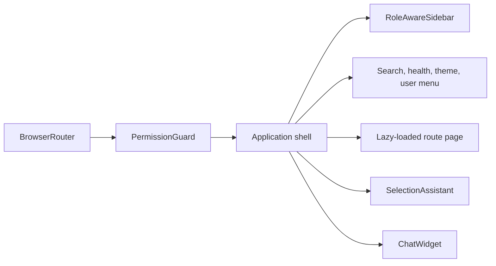

# Pages and Routes

This reference covers every active route registered in `frontend/src/App.jsx`. All application routes except `/login` are rendered inside the authenticated shell and protected by `PermissionGuard`. Data-source labels describe the implementation, not the deployment: a page may call a real API endpoint while the API is configured to ingest deterministic mock alerts.

## Shared Application Shell

**File locations:** `frontend/src/App.jsx`, `frontend/src/components/RoleAwareSidebar.jsx`

The shell loads the signed-in session, enforces frontend role visibility, renders role-specific navigation, polls dependency health every 30 seconds, persists the selected theme in `localStorage`, and mounts the global search, selection assistant, and chat widget. API authorization is enforced separately by the Express service.



<!-- SCREENSHOT PLACEHOLDER: Capture one authenticated shell screenshot per role after the full stack is running. -->

## Login

**Route/file:** `/login` → `frontend/src/components/LoginPage.jsx`  
**Audience:** Unauthenticated users.

The page accepts a username and password, creates a cookie-backed API session, stores the returned CSRF token in memory, and redirects the user to the landing page for the server-issued role. It does not provide registration, password recovery, SSO, or MFA flows.

**Component tree**

- `LoginPage`
  - Brand panel
  - Username/password form
  - Submit `Button`
  - Inline error/status message

| Data source | Classification | Behavior |
|---|---|---|
| `POST /api/auth/login` | Live API backed by PostgreSQL users | Creates the signed session; no hardcoded frontend user. |

**Interactions:** Form submission calls the API. Authentication failures stay on the page and display the returned error. Successful login causes `App` to load `/api/auth/session` and navigate by role.

**Known gaps:** No password reset, MFA, or external identity provider is implemented. See [Authentication](FEATURE_STATUS.md#feature-authentication) and [enterprise identity](FEATURE_STATUS.md#feature-enterprise-identity).

```text
+------------------------+----------------------+
| Product/context panel  | Username             |
|                        | Password             |
|                        | [Sign in]            |
+------------------------+----------------------+
```

<!-- SCREENSHOT PLACEHOLDER: Capture the login page at desktop width with no credentials entered. -->

## Executive Dashboard

**Route/file:** `/dashboard` → `frontend/src/pages/Dashboard.jsx`  
**Audience:** Executive users.

The dashboard summarizes operational risk, active incidents, business-service exposure, AI decision activity, and data-source health. It is a read-only executive view; detailed records open in a URL-backed drawer rather than changing operational state.

**Component tree**

- `Dashboard`
  - `ExecutiveKpiGrid`
  - `ExecutiveRiskPanel`
  - `RiskTrendChart`
  - `ExecutiveDecisionQueue`
  - `BusinessAssetList`
  - `ExecutiveBriefing`
  - `ExecutiveAiValue`
  - `ExecutiveDataTrust`
  - `DeepDiveDrawer`

| Data source | Classification | Notes |
|---|---|---|
| `GET /api/executive/overview?days={7|30|90}` | Live database aggregate | Alert and incident aggregates are real for the connected database. Business-service mappings use a seeded taxonomy; time-saved values are estimates. |
| `GET /api/collector/status` | Live API runtime state | Reports collector state and last runs. |
| `GET /api/health/dependencies` | Live API health probe | Reports PostgreSQL, enrichment, and AI-provider dependency state. |

**State/interactions:** The 7/30/90-day selector updates local state and reloads all three endpoints. Data refreshes every 30 seconds while visible. Selecting a risk, incident, decision, or asset writes drawer state to the URL through `useDeepDiveDrawer`; closing the drawer removes it.

**Known gaps:** Service ownership is based on code-defined mappings rather than a live CMDB relationship model. See [Executive dashboard](FEATURE_STATUS.md#feature-executive-dashboard).

```text
+ KPI strip ------------------------------------------------+
| Risk panel | Trend chart                                  |
| Decision queue               | Business asset exposure    |
| Briefing | AI value | Data trust                          |
+------------------------------------------- [detail drawer] +
```

<!-- SCREENSHOT PLACEHOLDER: Capture the populated 30-day dashboard with the deep-dive drawer closed. -->

## Live Monitoring

**Route/file:** `/live-monitoring` → `frontend/src/pages/LiveMonitoring.jsx`  
**Audience:** Analysts.

Live Monitoring presents the newest alert activity, collector status, and a detail rail for rapid review. “Live” means 15-second browser polling; no WebSocket or server-sent event feed is implemented.

**Component tree**

- `LiveMonitoring`
  - Page header and `LiveIndicator`
  - Source/severity/time filters
  - Grouped or individual activity list
    - Activity row
    - `SeverityBadge`
    - `StatusChip`
  - Detail rail and navigation actions

| Data source | Classification | Notes |
|---|---|---|
| `GET /api/alert-groups` or `GET /api/alerts` | Live REST API; upstream source configurable | The API can use Elastic, Splunk, Wazuh, a managed connector, or deterministic mock records. Mock is the repository default. |
| `GET /api/collector/status` | Live API runtime state | Used for freshness and connectivity messaging. |
| Muted rows | Browser memory only | Muting hides the row until reload; it does not call the API. |

**State/interactions:** Source, severity, time range, grouping, selection, and pagination are local state. Pausing stops visible replacement and buffers refreshed results; resuming applies the buffer. Row actions navigate to alert triage, investigations, or replay. Refresh calls the same endpoints immediately.

**Known gaps:** There is no push transport and mute is not persisted. See [Live Monitoring feed](FEATURE_STATUS.md#feature-live-monitoring-feed) and [monitoring quick actions](FEATURE_STATUS.md#feature-monitoring-quick-actions).

```text
+ Header: status / pause / refresh -------------------------+
| Filters                                                     |
| Activity feed (grouped or individual) | Selected detail    |
| Pagination                              | Triage/replay links|
+------------------------------------------------------------+
```

<!-- SCREENSHOT PLACEHOLDER: Capture grouped mode with a selected high-severity activity. -->

## Security Analytics

**Route/file:** `/security-analytics` → `frontend/src/pages/SOCAnalytics.jsx`  
**Audience:** Analysts.

Security Analytics aggregates alert volume and rank distributions over 24 hours, 7 days, or 30 days. Charts are backed by SQL aggregates over the alerts currently persisted by the API.

**Component tree**

- `SOCAnalytics`
  - Period selector and refresh control
  - KPI cards
  - Recharts area trend
  - Severity distribution
  - `RankedBarList` panels for sources, destinations, datasets, tactics, and identities

| Data source | Classification | Notes |
|---|---|---|
| `GET /api/analytics/security?hours={24|168|720}` | Live database aggregate | Accuracy reflects the configured ingest source; the default source is mock. |

**State/interactions:** Period and loading/error state are local. The page polls every 60 seconds. Selecting a severity or ranked entity navigates to `/alerts` with a search/filter query; chart clicks do not mutate server state.

**Known gaps:** There is no saved dashboard configuration or user-defined query builder. See [Security Analytics](FEATURE_STATUS.md#feature-security-analytics).

```text
+ Period / refresh ------------------------------------------+
| KPI cards                                                   |
| Alert trend                    | Severity distribution      |
| Source IPs | Destinations | Datasets | Tactics | Identities |
+------------------------------------------------------------+
```

<!-- SCREENSHOT PLACEHOLDER: Capture the 24-hour analytics view with populated ranking panels. -->

## Alerts / Triage Workspace

**Route/file:** `/alerts` → `frontend/src/pages/Alerts.jsx`  
**Audience:** Analysts.

The alert workspace lists grouped or individual alerts and exposes stored enrichment, model verdict, evidence, citations, workflow trace, and human-review controls. AI values are read from the database; the frontend does not generate or randomize confidence values.

**Component tree**

- `Alerts`
  - Filters, view toggle, pagination
  - Alert list and pin controls
  - Alert detail
    - `TriageDecisionSummary`
    - `TriageWorkflow`
    - `AnalystDecisionReview`
    - `DecisionQualityPanel`
    - Journey/timeline tabs
    - Response readiness checklist

| Data source | Classification | Notes |
|---|---|---|
| `GET /api/alerts` or `GET /api/alert-groups` | Live PostgreSQL query | Underlying alerts may originate from configured connectors or mock ingest. |
| `GET /api/alerts/:id` | Live database record | Includes stored normalized, enrichment, and triage fields. |
| `GET /api/alerts/:id/journey` | Live database/audit projection | Builds the recorded ingest-to-review journey. |
| `POST /api/alerts/:id/retriage` | Live API plus configured Hermes provider | Requires AI credentials and performs a new server-side triage. |
| `POST /api/workflow-reviews` | Live database write | Persists analyst confirmation/correction. |
| Pins and view preferences | `localStorage` | Stored under browser-specific BMB keys. |
| Response checklist | Component memory only | Ticking readiness items does not create an action or response. |

**State/interactions:** Filters and the selected record drive API requests. Selection loads detail and journey concurrently; retriage reloads the list. Pinning and the chosen list view persist locally. “Investigate” navigates to a prefilled investigation. Review submission writes to the API.

**Known gaps:** The response-readiness checklist is not an execution control. See [Alert triage](FEATURE_STATUS.md#feature-alert-triage) and [external response execution](FEATURE_STATUS.md#feature-external-response-execution).

```text
+ Filters / group toggle ------------------------------------+
| Alert list                       | Alert detail             |
| pinned rows / pagination         | verdict / workflow       |
|                                  | evidence / review / trail|
+------------------------------------------------------------+
```

<!-- SCREENSHOT PLACEHOLDER: Capture a triaged alert with the decision workflow and evidence visible. -->

## AI Triage Queue

**Route/file:** `/ai-triage` → `frontend/src/pages/AITriage.jsx`  
**Audience:** Analysts according to the frontend route policy; the route is not listed in the analyst sidebar.

The page displays pending and completed alert triage states, summary statistics, row selection, per-alert retriage, and a batch “run pending queue” command. The batch command currently conflicts with API authorization and cannot succeed for any role that can open this route.

**Component tree**

- `AITriage`
  - Summary cards
  - Status/severity controls
  - Selectable alert queue
  - Per-row verdict/status
  - Batch action toolbar

| Data source | Classification | Notes |
|---|---|---|
| `GET /api/alerts` and `GET /api/stats` | Live database API | Alert origin remains deployment-configurable; mock is default. |
| `POST /api/alerts/:id/retriage` | Live Hermes-backed operation | Runs sequentially for selected rows. |
| `POST /api/scheduler/triage-pending` | Live API, but inaccessible from this route | API requires administrator; frontend route permits analyst only. |

**State/interactions:** Filtering and selection are local. Retriage calls the API per selected row and reloads data. The queue runner calls a protected scheduler endpoint and currently receives `403` for analysts.

**Known gaps:** See [AI triage queue](FEATURE_STATUS.md#feature-ai-triage-queue) and [role mismatch issue](KNOWN_ISSUES.md#ki-003-ai-triage-batch-action-has-no-authorized-ui-user).

```text
+ Stats / refresh / run pending -----------------------------+
| Filters                                                     |
| [ ] Alert | severity | status | verdict | confidence        |
| Batch retriage controls                                     |
+------------------------------------------------------------+
```

<!-- SCREENSHOT PLACEHOLDER: Capture the queue with multiple rows selected and the batch toolbar visible. -->

## Incidents

**Route/file:** `/incidents` → `frontend/src/pages/Incidents.jsx`  
**Audience:** Analysts; the component also supports a read-only executive composition.

The incident workspace presents correlated alerts as durable incident records, with status, owner, AI correlation trace, evidence journey, human review, notes through the case projection, and PDF reporting.

**Component tree**

- `Incidents`
  - Status filter and incident list
  - Incident detail
    - `IncidentCorrelationTrace`
    - `AnalystDecisionReview`
    - Evidence/journey timeline
    - Owner and status controls
    - Report download
    - Session containment acknowledgements

| Data source | Classification | Notes |
|---|---|---|
| `GET /api/incidents`, `GET /api/incidents/:id` | Live PostgreSQL records | Incidents are created by the correlation worker when enabled or manually run. |
| `GET /api/incidents/:id/journey` | Live database/audit projection | Includes contributing alerts and recorded operations. |
| `PATCH /api/incidents/:id` | Live database write | Persists status. |
| `PATCH /api/cases/:id` | Live database write | Persists owner through the incident-backed case record. |
| `GET /api/reports/incidents/:id` | Live PDF endpoint | Generated by PDFKit from current stored data. |
| Containment acknowledgements | Component memory only | Does not isolate hosts, disable accounts, or block IPs. |

**State/interactions:** Status filtering and record selection reload the relevant API data; URL `incident` can preselect a record. Status and owner changes persist. “Generate report” opens the PDF endpoint. Review submissions persist; containment checkboxes only change local state.

**Known gaps:** See [Incident management](FEATURE_STATUS.md#feature-incident-management) and [external response execution](FEATURE_STATUS.md#feature-external-response-execution).

```text
+ Status filter ---------------------------------------------+
| Incident list                    | Incident detail          |
|                                  | correlation / evidence   |
|                                  | owner / status / report  |
+------------------------------------------------------------+
```

<!-- SCREENSHOT PLACEHOLDER: Capture an incident with its correlation trace expanded. -->

## Investigations

**Route/file:** `/investigations` → `frontend/src/pages/Investigations.jsx`  
**Audience:** Analysts.

Investigations are analyst-created workspaces that collect alert identifiers, a reusable search query, notes, owner, and status. Unlike page-only annotations, investigation records and notes are stored in PostgreSQL.

**Component tree**

- `Investigations`
  - Investigation list and filters
  - Create form
  - Alert search/attachment results
  - Investigation detail
    - Metadata editor
    - Attached alerts
    - Notes timeline/editor
    - Open-triage and delete actions

| Data source | Classification | Notes |
|---|---|---|
| `GET/POST /api/investigations` | Live database API | Lists and creates durable workspaces. |
| `GET/PATCH/DELETE /api/investigations/:id` | Live database API | Reads, edits, or deletes the selected record. |
| `POST /api/investigations/:id/notes` | Live database write | Persists a note with author/time metadata. |
| `GET /api/alerts?search=...` | Live database search | Used to locate evidence to reference. |

**State/interactions:** Search, filters, create form, selection, and draft notes are local state. Create/edit/note/delete actions call the API and refresh the list. “Open in Technical Triage” navigates to `/alerts` with the investigation query.

**Known gaps:** Attached alert IDs are references rather than immutable evidence snapshots. See [Investigations](FEATURE_STATUS.md#feature-investigations).

```text
+ Investigation list ------+ Selected workspace ----------+
| filters / create          | owner / status / query       |
| records                   | alert references             |
|                           | notes / edit / delete         |
+---------------------------+-------------------------------+
```

<!-- SCREENSHOT PLACEHOLDER: Capture a populated investigation with notes and attached alert references. -->

## Cases

**Route/file:** `/cases` → `frontend/src/pages/Cases.jsx`  
**Audience:** Analysts.

Cases provide an operational view over incident-backed case records. Analysts can change owner and status, append notes, open the source incident, and generate an incident report.

**Component tree**

- `Cases`
  - Case list and status filters
  - Selected case detail
    - Summary and evidence
    - Owner/status controls
    - Note editor and history
    - Incident/report links

| Data source | Classification | Notes |
|---|---|---|
| `GET /api/cases`, `GET /api/cases/:id` | Live PostgreSQL API | Case identity is tied to the underlying incident. |
| `PATCH /api/cases/:id` | Live database write | Persists owner and status fields. |
| `POST /api/cases/:id/notes` | Live database write | Persists analyst notes. |
| `GET /api/reports/incidents/:id` | Live generated PDF | Uses the case/incident ID. |

**State/interactions:** Filtering, selection, and note drafts are local. Owner/status edits and notes call the API. Navigation opens `/incidents?incident={id}`; report generation opens the PDF endpoint.

**Known gaps:** Cases are not an independent domain object with separate SLA, queue, or attachment handling. See [Case management](FEATURE_STATUS.md#feature-case-management).

```text
+ Case filters ----------------------------------------------+
| Case list                        | Case detail              |
|                                  | status / owner           |
|                                  | evidence / notes / report|
+------------------------------------------------------------+
```

<!-- SCREENSHOT PLACEHOLDER: Capture an open case with owner and note history visible. -->

## Digital Twin

**Route/file:** `/digital-twin` → `frontend/src/pages/DigitalTwin.jsx`  
**Audience:** Analysts.

Digital Twin derives a host, identity, and network topology from up to 100 recent alerts and replays those observations through a synchronized local event stream. It is not connected to a live network-discovery or asset-graph service.

**Component tree**

- `DigitalTwin`
  - Summary and view controls
  - `NetworkTopologyCanvas`
    - SVG nodes and edges
    - Pan/zoom controls
  - `TopologyLegend`
  - Synchronized event timeline
  - Selected entity/evidence detail

| Data source | Classification | Notes |
|---|---|---|
| `GET /api/alerts?limit=100` | Live API sample | Topology is computed client-side by `buildObservedTopology`; upstream alerts can be mocked. |
| Playback/event state | Component memory | `useSynchronizedEventStream` advances locally and resets on reload. |

**State/interactions:** The page polls alerts every 15 seconds while visible. Selecting nodes/edges changes the detail panel. Pan, zoom, reset, play/pause, speed, and event selection are local. A 1.4-second settle animation updates the displayed topology; no topology state is written to the API.

**Known gaps:** The graph is a recent-alert visualization, not a persistent digital representation of the environment. See [Digital Twin topology](FEATURE_STATUS.md#feature-digital-twin-topology).

```text
+ Summary / playback controls -------------------------------+
|                                                            |
|             Pan/zoom topology canvas        | Entity detail|
|                                                            |
| Event timeline / evidence                                   |
+------------------------------------------------------------+
```

<!-- SCREENSHOT PLACEHOLDER: Capture a topology containing at least one host, identity, and network edge. -->

## Attack Simulator

**Route/file:** `/attack-simulator` → `frontend/src/pages/AttackSimulator.jsx`  
**Audience:** Analysts.

Attack Simulator contains two browser-side experiences: a training scenario player driven by hardcoded scenario definitions and a replay workspace that reconstructs phases from persisted alert evidence. Neither mode launches traffic, malware, or actions against external systems.

**Component tree**

- `AttackSimulator`
  - Mode selector
  - Training mode
    - Hardcoded scenario selector
    - `MitreKillChain`
    - `SimulationResponse`
    - Synchronized event stream
  - Alert replay mode
    - `AlertReplayWorkspace`
    - `AlertReplayScene`
    - Evidence/phase detail

| Data source | Classification | Notes |
|---|---|---|
| `ATTACK_SCENARIOS` in `AttackSimulator.jsx` | Hardcoded frontend data | Drives training steps, actors, techniques, and timing. |
| Recent triaged alert list/detail/journey | Live API through `AlertReplayWorkspace` | Reconstructs stored alert history; it does not rerun the model. |
| Playback state | Component memory | Timing, speed, selected event, and reset are local. |

**State/interactions:** Scenario/mode choice, playback, speed, phase selection, and simulated response choices update local state. Replay fetches eligible alerts, then loads detail and journey. No interaction changes API records or connected infrastructure.

**Known gaps:** See [Attack Simulator training](FEATURE_STATUS.md#feature-attack-simulator-training), [alert replay](FEATURE_STATUS.md#feature-alert-replay), and [attack execution](FEATURE_STATUS.md#feature-attack-execution).

```text
+ Mode / scenario / playback --------------------------------+
| MITRE phase chain                                           |
| Scenario or alert replay scene       | Phase/evidence detail|
| Simulated response summary                                  |
+------------------------------------------------------------+
```

<!-- SCREENSHOT PLACEHOLDER: Capture one training scenario at an active phase and one real-alert replay. -->

## MITRE Coverage

**Route/file:** `/mitre-coverage` → `frontend/src/pages/MitreCoverage.jsx`  
**Audience:** Analysts.

MITRE Coverage implements an incident path view and an aggregate tactic/technique coverage heatmap. Incident actions create approval-gated internal simulation requests; they do not execute controls in EDR, identity, firewall, or other external products.

**Component tree**

- `MitreCoverage`
  - Incident/Coverage view tabs
  - Incident view
    - Incident selector
    - Tactic/technique path
    - Event timeline and evidence detail
    - Proposed action control
  - Coverage view
    - 7/30/90-day selector
    - Tactic summary
    - Technique heatmap/table

| Data source | Classification | Notes |
|---|---|---|
| `GET /api/mitre/incidents?limit=100` | Live database projection | Returns incidents with MITRE evidence. |
| `GET /api/mitre/incidents/:id` | Live database projection | Builds the selected incident path from persisted alerts. |
| `GET /api/mitre/coverage?range={7|30|90}` | Live SQL aggregate | Heatmap represents stored alerts in the chosen range. |
| `POST /api/actions` | Live internal workflow write | Creates an approval request for a simulated action. |

**State/interactions:** View, range, selected incident, technique, and event are local/URL state. Range or incident changes refetch. Requesting an action writes a pending approval record, which can later produce an internal simulated response.

**Known gaps:** External control execution is absent. See [MITRE incident view](FEATURE_STATUS.md#feature-mitre-incident-view), [MITRE coverage heatmap](FEATURE_STATUS.md#feature-mitre-coverage-heatmap), and [external response execution](FEATURE_STATUS.md#feature-external-response-execution).

```text
+ Incident view | Coverage view -----------------------------+
| Tactic / technique path or aggregate matrix                |
| Timeline / evidence                    | Selected detail    |
| Approval-gated proposed action                              |
+------------------------------------------------------------+
```

<!-- SCREENSHOT PLACEHOLDER: Capture the incident path view and the 30-day coverage heatmap. -->

## Threat Intelligence

**Route/file:** `/threat-intelligence` → `frontend/src/pages/ThreatIntelligence.jsx`  
**Audience:** Analysts.

Threat Intelligence pivots an indicator across locally stored alerts and incidents, displays their relationships, and provides links into alert and investigation workflows. It does not query an external threat-intelligence platform directly.

**Component tree**

- `ThreatIntelligence`
  - Indicator search and actions
  - Summary cards
  - `EntityRelationshipGraph`
  - Matching alerts and incidents
  - Saved-pivot/watchlist state

| Data source | Classification | Notes |
|---|---|---|
| `GET /api/pivot?indicator=...` | Live database/API search | Searches stored alert fields and related incidents; any TIP evidence comes from the bundled enrichment service. |
| Saved pivots | `localStorage` | Browser-local watchlist; no server synchronization. |

**State/interactions:** Search calls the API. Selecting graph entities or results updates detail/navigation. Save/remove changes `localStorage`; copy uses the Clipboard API. “Ask AI Analyst” opens the global streamed chat with a prepared prompt.

**Known gaps:** No live TAXII/STIX or vendor threat-intelligence connector is implemented. See [Threat-intelligence pivot](FEATURE_STATUS.md#feature-threat-intelligence-pivot).

```text
+ Indicator search / save / investigate / ask AI ------------+
| Summary cards                                                |
| Relationship graph                    | Entity detail        |
| Matching alerts                       | Related incidents     |
+-------------------------------------------------------------+
```

<!-- SCREENSHOT PLACEHOLDER: Capture a pivot with a populated relationship graph. -->

## Assets

**Route/file:** `/assets` → `frontend/src/pages/Assets.jsx`  
**Audience:** Analysts.

Assets constructs an inventory-like view from entities observed in the latest 100 alerts and their enrichment payloads. It is a sampled operational view, not a complete CMDB or authoritative asset inventory.

**Component tree**

- `Assets`
  - Search/type/risk filters
  - Derived asset list
  - Asset profile
    - Risk and activity summary
    - Related alerts
    - Triage/investigation/copy actions

| Data source | Classification | Notes |
|---|---|---|
| `GET /api/alerts?limit=100` | Live API sample | Client derives hosts, identities, and IPs from alert/enrichment fields. The enrichment data may be bundled JSON. |

**State/interactions:** Filters and selection are local. “View related alerts” and “Build investigation” navigate with prefilled queries. Copy uses the Clipboard API. The page does not update an asset record.

**Known gaps:** Coverage is capped to a recent sample and has no asset CRUD or authoritative discovery feed. See [Asset inventory](FEATURE_STATUS.md#feature-asset-inventory).

```text
+ Search / type / risk filters ------------------------------+
| Derived asset list                | Asset profile           |
|                                   | activity / related alerts|
|                                   | triage / investigate     |
+-------------------------------------------------------------+
```

<!-- SCREENSHOT PLACEHOLDER: Capture a selected host profile with related alerts. -->

## Vulnerabilities

**Route/file:** `/vulnerabilities` → `frontend/src/pages/Vulnerabilities.jsx`  
**Audience:** Analysts.

Vulnerabilities extracts structured vulnerability findings from enrichment payloads and creates lower-confidence exposure signals from exploit-related alerts. It does not scan assets and is not a complete vulnerability-management repository.

**Component tree**

- `Vulnerabilities`
  - Summary/filter controls
  - Derived finding list
  - Finding detail
    - Asset, package, score, severity, source evidence
    - Alert and investigation links

| Data source | Classification | Notes |
|---|---|---|
| `GET /api/alerts?limit=100` | Live API sample | Client parses bundled enrichment vulnerability findings or alert-derived signals. |

**State/interactions:** Search/filter/selection are local. Action buttons navigate to the source alert or an investigation query. No remediation state or ticket is written.

**Known gaps:** No scanner integration, asset-wide coverage, exception workflow, SLA, or remediation tracking exists. See [Vulnerability workspace](FEATURE_STATUS.md#feature-vulnerability-workspace).

```text
+ Exposure summary / filters --------------------------------+
| Finding list                    | Finding detail            |
|                                 | asset / package / evidence|
|                                 | alert / investigation     |
+------------------------------------------------------------+
```

<!-- SCREENSHOT PLACEHOLDER: Capture one structured vulnerability finding and its source evidence. -->

## Playbooks

**Route/file:** `/playbooks` → `frontend/src/pages/Playbooks.jsx`  
**Audience:** Analysts according to route policy; the route is absent from the analyst sidebar.

The Playbooks page provides four code-defined checklists and records step progress in the current browser. It does not orchestrate integrations, create response records, or persist execution history in PostgreSQL.

**Component tree**

- `Playbooks`
  - Hardcoded playbook list
  - Selected playbook metadata
  - Ordered checklist
  - Complete/reset controls

| Data source | Classification | Notes |
|---|---|---|
| Playbook definitions in `Playbooks.jsx` | Hardcoded frontend data | Four definitions are compiled into the bundle. |
| Progress under `bmb-playbook-runs` | `localStorage` | Browser-local and unaudited. |

**State/interactions:** Selecting a playbook and checking/resetting steps updates local state and `localStorage`. No action calls the API.

**Known gaps:** See [Playbooks](FEATURE_STATUS.md#feature-playbooks) and [hidden navigation](KNOWN_ISSUES.md#ki-005-valid-pages-are-absent-from-role-navigation).

```text
+ Playbook list -------------+ Selected checklist ----------+
| four definitions           | ordered steps                |
|                             | [complete] [reset]            |
+----------------------------+-------------------------------+
```

<!-- SCREENSHOT PLACEHOLDER: Capture a partially completed playbook checklist. -->

## Reports

**Route/file:** `/reports` → `frontend/src/pages/Reports.jsx`  
**Audience:** Analysts, executives, and administrators; the API limits detailed reports to analyst/administrator roles.

Reports exposes downloadable PDFs generated from current database contents. The page contains direct links rather than a report scheduling or saved-report system.

**Component tree**

- `Reports`
  - Executive summary report card
  - Detailed alerts report card
  - Detailed incidents report card
  - Permission-aware download links

| Data source | Classification | Notes |
|---|---|---|
| `/api/reports/executive-summary` | Live server-generated PDF | Available to authenticated roles. |
| `/api/reports/alerts`, `/api/reports/incidents` | Live server-generated PDF | Analyst/administrator only; generated with PDFKit. |

**State/interactions:** The selected report download is the only page state. Links navigate directly to API PDF responses; no report configuration is persisted.

**Known gaps:** No schedule, template editor, historical artifact storage, or asynchronous export queue is implemented. See [Reports](FEATURE_STATUS.md#feature-reports).

```text
+ Reports ---------------------------------------------------+
| Executive summary [download]                               |
| Alerts detail [download] | Incidents detail [download]     |
+------------------------------------------------------------+
```

<!-- SCREENSHOT PLACEHOLDER: Capture the report catalog as an analyst and as an executive. -->

## Integrations

**Route/file:** `/integrations` → `frontend/src/pages/Integrations.jsx`  
**Audience:** Administrators.

Integrations is a status and routing page for telemetry, AI, and enrichment dependencies. It does not edit connectors directly; the active managed-connector CRUD interface is mounted in Settings.

**Component tree**

- `Integrations`
  - Dependency summary
  - Connection cards
    - Telemetry/collector
    - AI provider
    - Enrichment service
  - Navigation actions to configuration pages

| Data source | Classification | Notes |
|---|---|---|
| `GET /api/health/dependencies` | Live dependency probes | Reflects current API reachability/configuration. |
| `GET /api/collector/status` | Live collector state | Includes current source and run health. |
| `GET /api/admin/runtime` | Live sanitized configuration | Does not expose credential values. |

**State/interactions:** Refresh reloads all sources. Card actions navigate to Collector Health, AI Configuration, or Settings. There are no writes on this page.

**Known gaps:** Connector management is split between this status page and Settings, which weakens information architecture. See [Integration management](FEATURE_STATUS.md#feature-integration-management) and [connector placement](KNOWN_ISSUES.md#ki-019-connector-management-is-separated-from-the-integrations-page).

```text
+ Dependency summary / refresh ------------------------------+
| Telemetry card | AI card | Enrichment card                 |
| Each card links to its configuration workspace             |
+------------------------------------------------------------+
```

<!-- SCREENSHOT PLACEHOLDER: Capture the dependency cards with one degraded dependency if available. -->

## Settings

**Route/file:** `/settings` → `frontend/src/pages/Settings.jsx`  
**Audience:** Administrators.

Settings summarizes sanitized runtime configuration and hosts the managed alert-source connector interface. Connector credentials are submitted to the API and encrypted at rest; they are never read back to the browser.

**Component tree**

- `Settings`
  - Runtime configuration table
  - Links to specialized admin pages
  - `ConnectorManager`
    - Connector list
    - Create/edit form
    - Test/activate/disable/delete controls

| Data source | Classification | Notes |
|---|---|---|
| `GET /api/admin/runtime`, `GET /api/settings` | Live sanitized database/runtime state | Settings are database-backed. |
| `/api/admin/connectors` CRUD and action endpoints | Live encrypted database API | Supports Elastic, Splunk, and Wazuh connector definitions. |

**State/interactions:** Refresh, navigation, connector creation/editing, connectivity tests, activation, disabling, and deletion call the API. Form values are local until submission. Activation changes the source selected by the collector pipeline.

**Known gaps:** Authentication copy incorrectly says the account is environment-managed despite database user administration. See [Settings and connectors](FEATURE_STATUS.md#feature-settings-and-connectors), [copy issue](KNOWN_ISSUES.md#ki-006-settings-describes-authentication-as-a-single-environment-account), and [connector placement](KNOWN_ISSUES.md#ki-019-connector-management-is-separated-from-the-integrations-page).

```text
+ Runtime configuration table -------------------------------+
| Telemetry | AI | Authentication | linked admin pages        |
| Managed connectors: list | form | test / activate / disable |
+------------------------------------------------------------+
```

<!-- SCREENSHOT PLACEHOLDER: Capture the sanitized runtime table and connector list without exposing credentials. -->

## Approvals

**Route/file:** `/approvals` → `frontend/src/pages/Approvals.jsx`  
**Audience:** Analysts in the frontend; the API decision endpoint also accepts administrators.

Approvals lists action proposals created by analyst workflows and records a human decision. Approval can create an internal response simulation; it is not authorization to an external EDR, IAM, or firewall connector.

**Component tree**

- `Approvals`
  - Status filters and refresh
  - Action request list
  - Selected evidence/reasoning detail
  - Approve/reject controls and note

| Data source | Classification | Notes |
|---|---|---|
| `GET /api/actions?page=1&limit=100` | Live PostgreSQL API | Lists durable action requests. |
| `POST /api/actions/:id/decision` | Live workflow write | Persists the decision and may create an internal simulated response. |

**State/interactions:** Status filter, selection, and decision note are local. Approve/reject calls the API and reloads the queue. The empty state links to Investigations.

**Known gaps:** There is no external response connector or separate multi-party approval policy. See [Approval workflow](FEATURE_STATUS.md#feature-approval-workflow).

```text
+ Status / refresh ------------------------------------------+
| Request queue                    | Evidence / rationale     |
|                                  | decision note            |
|                                  | [approve] [reject]        |
+------------------------------------------------------------+
```

<!-- SCREENSHOT PLACEHOLDER: Capture a pending action request with evidence and decision controls. -->

## Responses

**Route/file:** `/responses` → `frontend/src/pages/Responses.jsx`  
**Audience:** Analysts in the frontend; the API response endpoints also accept administrators.

Responses records the outcome of approved simulated actions and supports a simulated rollback. The records are durable and audited, but no production response-system integration is present.

**Component tree**

- `Responses`
  - Status summary and filters
  - Response list
  - Response detail
    - Action/evidence context
    - Before/after state
    - Related alert links
    - Rollback control

| Data source | Classification | Notes |
|---|---|---|
| `GET /api/responses`, `GET /api/responses/:id` | Live PostgreSQL API | Stores internal simulation results. |
| `POST /api/responses/:id/rollback` | Live internal state write | Marks/reverses the simulation record; it does not restore an external system. |

**State/interactions:** Filters and selection are local. Selecting a row loads detail. Rollback requires confirmation then calls the API. Links open approval records or related alerts.

**Known gaps:** See [Simulated responses](FEATURE_STATUS.md#feature-simulated-responses) and [external response execution](FEATURE_STATUS.md#feature-external-response-execution).

```text
+ Response status / filters ---------------------------------+
| Response history                 | Response detail          |
|                                  | state / evidence / links |
|                                  | [rollback simulation]    |
+------------------------------------------------------------+
```

<!-- SCREENSHOT PLACEHOLDER: Capture a completed simulated response and its before/after state. -->

## Collector Health

**Route/file:** `/collector-health` → `frontend/src/pages/CollectorHealth.jsx`  
**Audience:** Administrators.

Collector Health exposes ingest/scheduler status, source configuration, timing, last-run results, and the controls that save collector settings or start an immediate collection cycle.

**Component tree**

- `CollectorHealth`
  - Status cards
  - Source/runtime details
  - Scheduler settings form
  - Last-run/error detail
  - Save and run-now controls

| Data source | Classification | Notes |
|---|---|---|
| `GET /api/collector/status`, `GET /api/scheduler/status` | Live runtime/database state | Shows active source and worker state. |
| `GET/PUT /api/settings` | Live database settings | Controls scheduler policy and related collector behavior. |
| `POST /api/scheduler/run-now` | Live worker operation | Starts one collector pipeline run. |

**State/interactions:** The page polls every 15 seconds while visible. Form edits are local until saved. Save writes settings; run-now triggers work and then refreshes status.

**Known gaps:** Connector secrets are configured in Settings, so troubleshooting spans two pages. Full external collector behavior depends on deployment credentials. See [Collector pipeline](FEATURE_STATUS.md#feature-collector-pipeline).

```text
+ Collector status / source / freshness --------------------+
| Scheduler configuration        | Last run / error detail    |
| [save settings] [run now]                                  |
+------------------------------------------------------------+
```

<!-- SCREENSHOT PLACEHOLDER: Capture active source, last successful run, and scheduler settings. -->

## AI Configuration

**Route/file:** `/ai-configuration` → `frontend/src/pages/AIConfiguration.jsx`  
**Audience:** Administrators.

AI Configuration reports Hermes dependency state, stored triage/correlation/agent policies, supported model aliases, recent agent state, and manual run controls. Model credentials remain environment-managed; this page does not store API keys.

**Component tree**

- `AIConfiguration`
  - Dependency/runtime status
  - Policy sections and save controls
  - Model catalog/test/activate controls
  - Agent and pipeline status
  - Manual triage/correlation/agent actions

| Data source | Classification | Notes |
|---|---|---|
| `/api/health/dependencies`, `/api/admin/runtime`, `/api/agent/status` | Live runtime status | Sanitized; no secrets returned. |
| `GET/PUT /api/settings` | Live PostgreSQL settings | Fresh databases default autonomous/AI pipeline policies to disabled. |
| `GET /api/admin/ai-models` | Live API over code-defined allowed models | Catalog availability depends on Hermes configuration. |
| Model test/activation and scheduler/agent POST endpoints | Live external/internal operations | Tests call the configured provider; manual runs use stored pipeline data. |

**State/interactions:** The page polls every 30 seconds. Draft policies are local until saved. Model test, activation, and manual-run buttons call their respective API endpoints and display returned results.

**Known gaps:** Hermes is external to this repository and no fallback model is embedded. See [AI provider integration](FEATURE_STATUS.md#feature-ai-provider-integration).

```text
+ Dependency / active model / agent status -----------------+
| Triage policy | Correlation policy | Agent policy           |
| Model catalog: test / activate                             |
| Manual operations and recent results                       |
+------------------------------------------------------------+
```

<!-- SCREENSHOT PLACEHOLDER: Capture the page with Hermes configured; redact environment-specific identifiers. -->

## Users & Access

**Route/file:** `/users-access` → `frontend/src/pages/UsersAccess.jsx`  
**Audience:** Administrators.

Users & Access administers database-backed local accounts and their executive, analyst, or administrator roles. Passwords are sent only on create and stored as scrypt hashes by the API.

**Component tree**

- `UsersAccess`
  - Authentication/runtime summary
  - User table
  - Create-user form/modal
  - Delete confirmation

| Data source | Classification | Notes |
|---|---|---|
| `GET /api/admin/runtime` | Live sanitized auth configuration | Indicates auth mode and bootstrapping state. |
| `GET/POST /api/admin/users` | Live PostgreSQL API | Lists users and creates a hashed-password account. |
| `DELETE /api/admin/users/:id` | Live database write | Removes the selected account subject to server checks. |

**State/interactions:** Search/filter, form values, modal visibility, and pending deletion are local. Create/delete call the API and refresh the list.

**Known gaps:** No password reset/change UI, SSO, MFA, SCIM, or fine-grained permissions are implemented. See [Authentication](FEATURE_STATUS.md#feature-authentication) and [enterprise identity](FEATURE_STATUS.md#feature-enterprise-identity).

```text
+ Authentication mode / add user ---------------------------+
| Username | display name | role | created | delete           |
| Create-user form / delete confirmation modal               |
+------------------------------------------------------------+
```

<!-- SCREENSHOT PLACEHOLDER: Capture the user table with usernames anonymized. -->

## Audit & Governance

**Route/file:** `/audit-governance` → `frontend/src/pages/AuditGovernance.jsx`  
**Audience:** Administrators.

Audit & Governance searches the immutable application audit-event records produced by authentication, administration, pipeline, workflow, and response operations.

**Component tree**

- `AuditGovernance`
  - Search/type/actor filters
  - Audit summary
  - Paginated event table
  - Event detail drawer/modal

| Data source | Classification | Notes |
|---|---|---|
| `GET /api/admin/audit-events?...` | Live PostgreSQL audit log | Server-applied filters and pagination. |

**State/interactions:** Query filters and selected event are local; applying filters reloads the API. The page is read-only and does not export or delete audit records.

**Known gaps:** No external SIEM export, cryptographic log sealing, or retention-specific export is implemented. See [Audit log](FEATURE_STATUS.md#feature-audit-log).

```text
+ Search / event type / actor filters -----------------------+
| Timestamp | actor | action | target | outcome              |
| Pagination                              [event detail]      |
+------------------------------------------------------------+
```

<!-- SCREENSHOT PLACEHOLDER: Capture filtered audit results with sensitive metadata redacted. -->

## Data Retention

**Route/file:** `/data-retention` → `frontend/src/pages/DataRetention.jsx`  
**Audience:** Administrators.

Data Retention displays table counts and retention policy, previews which records would be deleted, runs confirmed deletion, and saves whether scheduled retention is enabled.

**Component tree**

- `DataRetention`
  - Governance/count summary
  - Policy form
  - Preview result
  - Exact-confirmation run control
  - Enable/disable scheduler setting

| Data source | Classification | Notes |
|---|---|---|
| `GET /api/admin/data-governance` | Live PostgreSQL metadata | Returns current counts and policy context. |
| `POST /api/admin/data-governance/retention/preview` | Live read-only calculation | Computes deletion candidates. |
| `POST /api/admin/data-governance/retention/run` | Destructive live database operation | API requires the exact confirmation value. |
| `PUT /api/settings` | Live database write | Persists retention scheduling settings. |

**State/interactions:** Policy fields and confirmation text are local. Preview is non-mutating. Run permanently deletes eligible database records after exact confirmation; enable/save updates settings.

**Known gaps:** No archive/export tier or recovery workflow is implemented. See [Data retention](FEATURE_STATUS.md#feature-data-retention).

```text
+ Record counts / retention enabled -------------------------+
| Policy inputs             | Preview deletion counts       |
| Exact confirmation        | [run retention] [save policy] |
+------------------------------------------------------------+
```

<!-- SCREENSHOT PLACEHOLDER: Capture a preview result only; do not run deletion for documentation. -->

## Unrouted and Hidden Page Files

| File/route | Current state | Consequence |
|---|---|---|
| `frontend/src/pages/Pivot.jsx` | Component exists but has no route in `App.jsx`. | Users reach equivalent pivot behavior through Threat Intelligence; this file is dead unless routed or removed. |
| `/ai-triage` | Valid analyst route, absent from `ROLE_NAVIGATION`. | Reachable only by direct URL or an indirect link. |
| `/playbooks` | Valid analyst route, absent from `ROLE_NAVIGATION`. | Reachable only by direct URL or an indirect link. |
| `frontend/src/components/AgentPerformanceHub.jsx` | Exported component has no active import. | Implemented UI is not rendered by a page. |

See [navigation issue KI-005](KNOWN_ISSUES.md#ki-005-valid-pages-are-absent-from-role-navigation).

## Screenshot Audit Note

The audit started the Vite application at `http://127.0.0.1:4173/` and verified that the root document was served. The in-app browser runtime reported no available browser instance, and the API was not running in that browser session; therefore no screenshot is represented here as a verified current full-stack rendering. Each section includes a targeted placeholder describing the capture that should be added after the Compose stack is available.

---

Last updated: 2026-08-26 — generated by full codebase, route, request-call, build, test, and local-server audit
